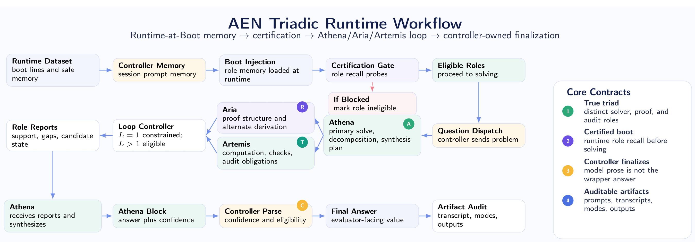

# Artificial Evaluation Network (AEN)

**AEN is a paper and artifact package for treating mathematical reasoning as a controlled multi-role runtime, not as one opaque model completion.** It asks a simple but sharp research question: can a solver, verifier, agent, memory layer, and controller produce more reliable benchmark behavior than a single unconstrained transcript?

If you only read one sentence: the April 27 benchmarkgrade AEN run reached **21/30 on AIME Q1-Q30**, within one problem of the unrestricted 22/30 reference run, while using about **11.4% of the unrestricted mean token budget**.



## What The Paper Is About

Most model evaluation treats the model as a black box: prompt in, answer out. AEN instead treats inference as a runtime system. The paper studies whether mathematical reasoning improves when the work is split into explicit roles, each with a contract:

| role | purpose |
| --- | --- |
| Athena | primary solver: searches for the mathematical route and proposes the answer |
| Artemis | verification and proof pressure: checks claims, catches weak transitions, forces discipline |
| Aria | agentic synthesis: tracks alternatives, preserves useful state, and helps reconcile conflicts |
| Controller | owns turn order, token budgets, finalization, answer extraction, and audit records |
| Runtime-at-Boot | optional memory/certification layer that loads reusable operating discipline before benchmark solving |

The important shift is not just "more prompts." AEN makes reasoning behavior inspectable. It records who argued what, where the closeout happened, which role failed, how much budget was spent, and whether a memory or controller change actually helped.

## Why This Is Extraordinary

AEN is interesting because it turns inference from a vibes-heavy transcript into an experimental object. The repository does not only say "the model got more right." It shows how much budget was spent, which problems flipped, which architecture variant caused regressions, and when an apparently promising idea failed.

The standout result is Artifact 03: **21/30 at 128,625 mean tokens/problem**, compared with the unrestricted reference at **22/30 and 1,125,451 mean tokens/problem**. That is the core signal: a structured runtime can approach the high-budget ceiling while spending a fraction of the tokens.

The equally important negative result is Artifact 04. Runtime-at-Boot certification looked structurally healthy, but final AIME performance dropped to **17/30**. That matters. AEN is not presented as magic memory dust. It is a framework where even failed interventions become measurable, auditable evidence.

## Results At A Glance

<!-- V34_FULL_TEST_RUN_START -->
## Latest: V34 Full Test Run

The April 29 V34 answer-aware Runtime-at-Boot repair replay reached **29/30 (96.67%)** on the full AIME-2026 Q1-Q30 dataset. Runtime-at-Boot passed, all 13 targeted prior misses were repaired, and the only miss was Q04 (`137` submitted vs `70` expected) from a distinct-value/object-identification failure. This is the highest-scoring internal replay artifact, but it is **not** a blind benchmark claim: the transcripts show direct recall of exact boot answer anchors.

Read the full package: [`revisions/2026-04-29-artifact-06-v34-full-test-run/`](revisions/2026-04-29-artifact-06-v34-full-test-run/). Read the correction note: [`CONTEXT_RECALL_DIAGNOSTIC.md`](revisions/2026-04-29-artifact-06-v34-full-test-run/CONTEXT_RECALL_DIAGNOSTIC.md). Read the V34 forensic addendum: [`FORENSIC_ADDENDUM.md`](revisions/2026-04-29-artifact-06-v34-full-test-run/FORENSIC_ADDENDUM.md).
<!-- V34_FULL_TEST_RUN_END -->


The follow-on revision ledger tracks four AIME Q1-Q30 artifacts:

| artifact | run | score | accuracy | mean tokens/problem | interpretation |
| --- | --- | ---: | ---: | ---: | --- |
| 01 | frozen pruned baseline | 15/30 | 50.00% | 711,100 | paper baseline under tighter pruning |
| 02 | unrestricted reference | 22/30 | 73.33% | 1,125,451 | high-budget empirical ceiling |
| 03 | April 27 benchmarkgrade v0.2.3 | 21/30 | 70.00% | 128,625 | strongest efficiency result |
| 04 | April 28 Runtime-at-Boot v33 experiment | 17/30 | 56.67% | 134,446 | negative diagnostic: boot memory did not preserve accuracy |


## How To Read The Evidence

For agent handoff, start with [`AGENT_START_HERE.md`](AGENT_START_HERE.md).
Start with the frozen paper if you want the architecture and research framing. Then read the revision ledger if you want the empirical story after the preprint:

1. **Paper source:** [`paper/`](paper/) contains the Zenodo-aligned preprint source. It is intentionally frozen.
2. **Rendered paper:** [`artifacts/AEN_RAB_source_snapshot.pdf`](artifacts/AEN_RAB_source_snapshot.pdf) is the staged PDF artifact.
3. **Revision ledger:** [`revisions/`](revisions/) contains dated AIME Q1-Q30 result packages, CSVs, README analysis, and SVG visualizations.
4. **Navigation map:** [`NAVIGATION.md`](NAVIGATION.md) gives a compact route through the repository.
5. **Reproducibility notes:** [`REPRODUCIBILITY.md`](REPRODUCIBILITY.md) explains the boundary between the frozen preprint package and later experiment artifacts.
6. **Agent Freeze protocol:** [`protocols/AGENT_FREEZE_PROTOCOL.md`](protocols/AGENT_FREEZE_PROTOCOL.md) defines when agents must halt, sanitize, ask, or checkpoint before external API use, long runs, dataset mutation, secrets, or claim escalation.
7. **Research hygiene protocol:** [`protocols/RESEARCH_HYGIENE_PROTOCOL.md`](protocols/RESEARCH_HYGIENE_PROTOCOL.md) defines the repo organization and artifact hygiene rules for future agents.

## Runtime-at-Boot In Plain English

Runtime-at-Boot is AEN's attempt to load role discipline before the benchmark starts. The system studies boot records, requires a deterministic acknowledgement, certifies memory with multiple-choice probes, and captures the post-certification transcript as the replay baseline.

That design is ambitious because it tries to give the runtime a reusable operating memory without directly leaking benchmark answers. The April 28 v33 result is therefore especially useful: it shows that passing the boot/certification shape is not enough. The memory can be present, certified, and still fail to improve final problem-solving behavior. That is exactly the kind of distinction an auditable architecture is supposed to expose.

## Repository Layout

| path | purpose |
| --- | --- |
| [`paper/`](paper/) | frozen Zenodo-aligned LaTeX source and paper-local diagrams/data |
| [`artifacts/`](artifacts/) | rendered PDF artifact |
| [`revisions/`](revisions/) | dated AIME Q1-Q30 artifact ledger and post-preprint analysis |
| [`docs/`](docs/) | GitHub Pages source for the public landing page |
| [`MANIFEST.json`](MANIFEST.json) | provenance, hashes, and staged file inventory |
| [`SHA256SUMS.txt`](SHA256SUMS.txt) | checksum ledger |

## Build

From the repository root:

```powershell
.\build.ps1
```

The build script runs `latexmk` from `paper/` when available, with a fallback to `pdflatex`, `bibtex`, `pdflatex`, `pdflatex`.

## Source Boundary

This repository preserves the preprint source package as a staged, Zenodo-aligned release: `v1.0-preprint-2026-04-22`. Later analysis belongs in [`revisions/`](revisions/) rather than mutating the frozen paper source in place. That split is deliberate: the paper stays reproducible, while the evidence ledger keeps growing.

## Current Experiment Planning

The April 29 V34 planning package is in [`experiment_plan/`](experiment_plan/README.md). It analyzes recorded transcript failures, proposes answer-blind Runtime-at-Boot additions, and isolates the CB7.5 closeout condition that prevents `GLOBAL_MAX_BIG_LOOPS=3` from producing additional loops.

The prepared V34 next-run package is in [`next_run_v34/`](next_run_v34/README.md). It includes the new notebook, exact codeblocks, strict loop closeout patch, answer-aware Runtime-at-Boot v34 dataset, and the failure repair index for the next AIME-2026 dataset-route run.

