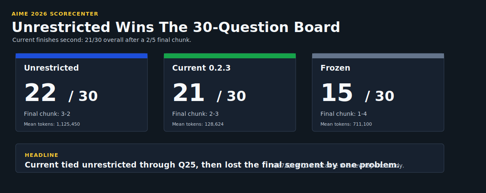
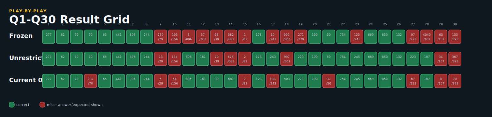
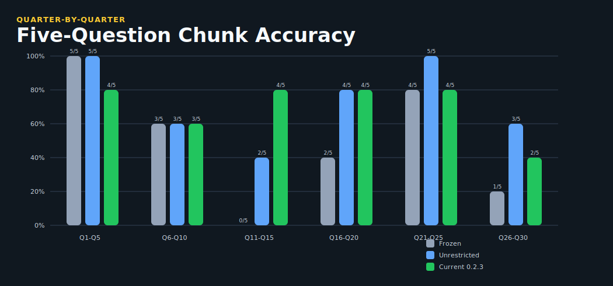
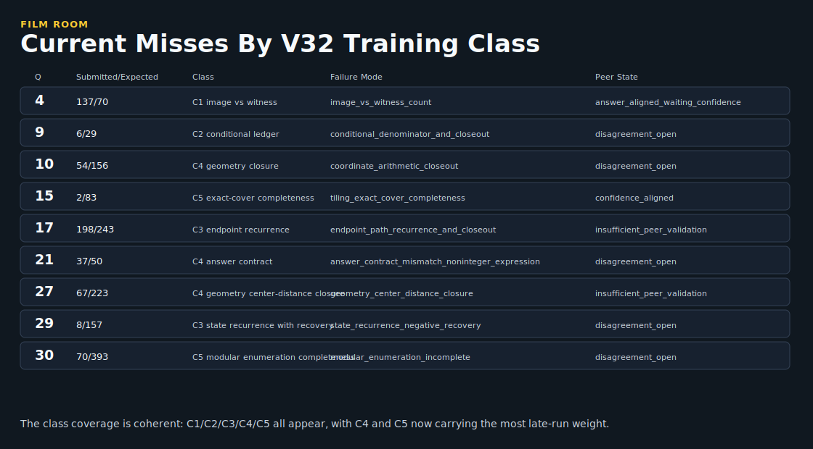
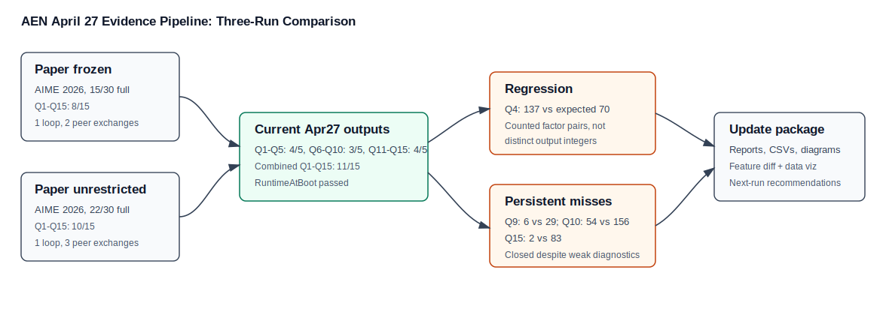
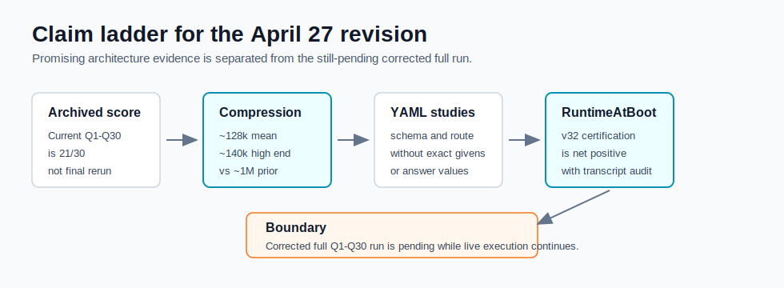

# April 27 AIME RuntimeAtBoot Revision

<div align="center">

# Frozen Canon To April 27

**A reproducible revision package for the AEN architecture paper: AIME Q1-Q30 evidence, RuntimeAtBoot v32, and the boot-memory preservation correction.**

| Frozen canon | Unrestricted reference | Current Apr27 0.2.3 |
| ---: | ---: | ---: |
| **15/30** | **22/30** | **21/30** |
| paper baseline | paper comparison run | archived April 27 current run |

</div>

---

## Start Here

| read | why |
| --- | --- |
| [Reproducibility](REPRODUCIBILITY.md) | exact offline execution order and success signals |
| [Revision Story](STORY.md) | claim ladder for the architectural leap, token compression, YAML-shaped studies, and pending corrected run |
| [Analysis](ANALYSIS.md) | what improved, what failed, and why the reset bug matters |
| [Changelog](CHANGELOG.md) | concise delta from the frozen canon |
| [Manifest](MANIFEST.md) | source paths, included assets, and boundary notes |

## The Visual Story

<table>
<tr>
<td width="50%"></td>
<td width="50%"></td>
</tr>
<tr>
<td width="50%"></td>
<td width="50%"></td>
</tr>
</table>

## What Changed

The April 27 branch is a natural extension of the paper rather than a replacement for it. The paper release remains frozen at the repository root. This folder adds the next evidence layer:

- Q1-Q30 current-run comparison against the frozen and unrestricted paper references.
- A small public table layer for scores, slices, token volume, late-game outcomes, and failure taxonomy.
- RuntimeAtBoot v32 staged dataset payload and certification harness audit.
- Extracted CB8 and CB11.5 cells that fix the boot-memory preservation path.
- A clear warning about the negative-control run where certified memory could be reset away before solving.

## Headline Result

| run | score | accuracy | mean total tokens |
| --- | ---: | ---: | ---: |
| Paper frozen pruned | 15/30 | 50.00% | 711,100 |
| Paper unrestricted | 22/30 | 73.33% | 1,125,451 |
| Current Apr27 0.2.3 | 21/30 | 70.00% | 128,625 |

Current was tied with the unrestricted run through Q25, then Q26-Q30 broke the tie: current went 2/5, unrestricted went 3/5, frozen went 1/5.

## RuntimeAtBoot v32

RuntimeAtBoot v32 is staged under [`runtime_at_boot/`](runtime_at_boot/). The intended semantics are strict:

- study rows are injected into live role context,
- certification rows are used only for certification,
- answer letters are rotated and audited,
- solve transcripts should demonstrate use of the class invariant, not answer recall.

The five problem-class overlays are image-vs-witness counts, conditional ledgers, endpoint/state recurrences, geometry closure, and exact-cover/enumeration completeness. A sixth overlay governs controller closeout.

## Corrected Execution Path

Use this revision order:

```text
CB4 -> CB6 -> CB6.5 -> CB7 -> CB7.5 -> CB8 v1.4.9 -> CB11.5 r4 -> CB12
```

CB12 stays unchanged. The required correction is that CB8 captures the boot-memory baseline and CB11.5 r4 restores it across both outer problem boundaries and the controller question reset before solving.

## Evidence Pipeline





## Data Layer

The public tables live in [`data/tables/`](data/tables/):

- `run_summary_q1_q30_and_slices.csv`
- `three_run_q1_q30_comparison.csv`
- `all_runs_q1_q30_long.csv`
- `current_q26_q30_detail.csv`
- `current_failure_warning_taxonomy_q1_q30.csv`

## Boundary

This package is careful about claims. The Q1-Q30 result is an archived April 27 current-run result. The CB8 v1.4.9 and CB11.5 r4 files are the corrected path for preserving RuntimeAtBoot memory in future/repeated runs. A run that passes boot certification but lacks preserved boot baselines is an invalid RuntimeAtBoot transfer test.

The corrected full Q1-Q30 RuntimeAtBoot run remains pending while live execution is ongoing. The current package supports an architectural-leap claim and a net-positive study/certification claim, not a final corrected-score claim.
