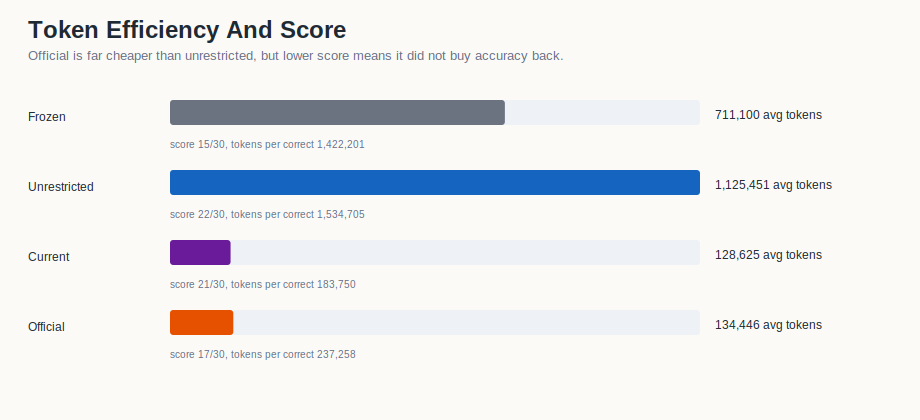

# April 27/28 AIME RuntimeAtBoot Revision

<div align="center">

# RuntimeAtBoot Negative Result And Repair Path

**A reproducible revision package for the AEN architecture paper: AIME Q1-Q30 evidence, RuntimeAtBoot v33/v32 dataset curation, the Apr28 negative boot run, and the next ack-gated CB8 repair.**

| Frozen canon | Unrestricted reference | Apr27 current 0.2.3 | Apr28 official boot run |
| ---: | ---: | ---: | ---: |
| **15/30** | **22/30** | **21/30** | **17/30** |
| paper baseline | paper comparison run | low-token controller gain | negative RuntimeAtBoot diagnostic |

</div>

---

## Read This First

The Apr28 official RuntimeAtBoot run did **not** validate the intended transfer claim. It degraded from the Apr27 current run at 21/30 to 17/30, even though per-problem solve tokens remained compact. That makes this revision more important, not less: it identifies a real certification/control failure instead of papering over it.

The bad signature was visible in CB8:

- `memory_studied: true`
- `ack_success_count: 0`
- baseline captured anyway
- MCQ certification continued anyway
- later, Q28 finalized despite `peer_validation_status: disagreement_open`

That behavior is now treated as invalid. RuntimeAtBoot memory study must be acknowledged before baseline capture, and disagreement must not be allowed to masquerade as clean finalization.

## Start Here

| read | why |
| --- | --- |
| [Official Apr28 Regression Note](OFFICIAL_APR28_RUNTIMEATBOOT_REGRESSION_NOTE.md) | negative RuntimeAtBoot result, Q28 failure, token forensics, and next one-question experiments |
| [Official Four-Run Report](official_four_run_report_20260428/OFFICIAL_FOUR_RUN_HEADLINE_REPORT.md) | copied Apr28 official tables and SVG visualizations |
| [Analysis](ANALYSIS.md) | what improved, what failed, and why reset/validation bugs matter |
| [Reproducibility](REPRODUCIBILITY.md) | exact offline execution order and success signals |
| [Revision Story](STORY.md) | original Apr27 architectural-leap narrative, now bounded by Apr28 negative evidence |
| [Manifest](MANIFEST.md) | source paths, included assets, and boundary notes |
| [Next Dataset Notes](runtime_at_boot/NEXT_DATASET_NOTES_V33.md) | v33 curation intake boundary |

## What The Four Runs Say

| run | score | accuracy | mean total tokens |
| --- | ---: | ---: | ---: |
| Paper frozen pruned | 15/30 | 50.00% | 711,100 |
| Paper unrestricted | 22/30 | 73.33% | 1,125,451 |
| Apr27 current 0.2.3 | 21/30 | 70.00% | 128,625 |
| Apr28 official boot run | 17/30 | 56.67% | 134,446 |

Apr27 showed a real controller/token-compression gain. Apr28 showed that the RuntimeAtBoot study/certification layer, as actually run, could damage performance. The strongest conclusion is not "more boot memory is better". The stronger conclusion is: boot memory must be compact, acknowledged, preserved, and subordinate to hard validation gates.

## Visual Story

<table>
<tr>
<td width="50%"></td>
<td width="50%"></td>
</tr>
<tr>
<td width="50%"></td>
<td width="50%"></td>
</tr>
</table>

## Q28 Is The Diagnostic

Q28 expected answer was `107`.

| run | answer | correct | total tokens |
| --- | ---: | --- | ---: |
| Frozen pruned | 4040 | false | 719,067 |
| Unrestricted | 107 | true | 1,182,933 |
| Apr27 current 0.2.3 | 107 | true | 145,529 |
| Apr28 official boot run | 12 | false | 116,594 |

The prior successful run let Artemis correct the route to the factor/chain model `4040 = 2^3 * 5 * 101`, yielding `1 + 1 + 1 + 4 + 100 = 107`. The official Apr28 run converged on the false capacity answer `12`; Aria left an exact-count feasibility blocker open, yet finalization still accepted the wrong integer.

## Current Repair Path

The next executable path is not another full Q1-Q30 run. It is one-question gating:

```text
CB4 -> CB6 -> CB6.5 -> CB7 -> CB7.5 -> CB8 v1.5.1 strict-ack owned-hooks 75-cert -> CB11.5 r4 -> CB12 one-question Q28
```

CB8 v1.5.1 is included under [`code/cb08_runtimeatboot_bootcert_v1_5_1_strict_ack_owned_hooks.py`](code/cb08_runtimeatboot_bootcert_v1_5_1_strict_ack_owned_hooks.py). It changes the failure mode directly:

- default certification returns to the frozen-style 75-line cap,
- study acknowledgement is exact-only and must pass before baseline capture,
- `memory_studied: true` cannot coexist with `ack_success_count: 0`,
- failed study returns a blocked boot gate rather than a poisoned baseline,
- stale notebook globals cannot reuse old CB8 context/validation hooks,
- validation rows expose `ack_success_count` and `ack_passed`.

## Data Layer

The public tables live in [`data/tables/`](data/tables/) and [`official_four_run_report_20260428/data_analysis/tables/`](official_four_run_report_20260428/data_analysis/tables/).

Key additions:

- `official_four_run_report_20260428/data_analysis/tables/four_run_q1_q30_comparison.csv`
- `official_four_run_report_20260428/data_analysis/tables/official_runtime_at_boot_summary.csv`
- `data/tables/q28_token_forensics_apr28.csv`

## Boundary

This package must be read as a negative/diagnostic RuntimeAtBoot revision. It supports the Apr27 low-token architectural improvement claim and the Apr28 finding that the boot-study/certification/control path was not yet safe. It does **not** claim a successful corrected full RuntimeAtBoot benchmark.

The next success criterion is narrow: Q28 must pass with acknowledged memory study, preserved baseline, and clean peer validation before any new full benchmark should be trusted.
