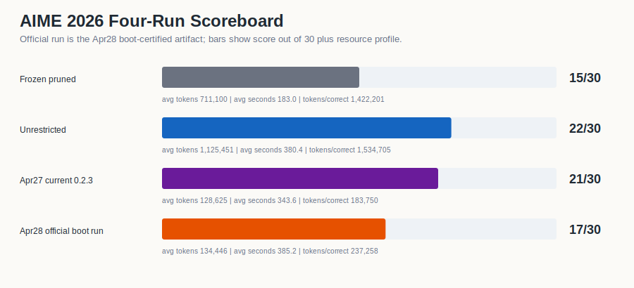

# Artifact 01 - Frozen Pruned Baseline

This is the first reference artifact in the AIME Q1-Q30 revision sequence. It is
the pruned paper baseline, preserved as a stable comparison point rather than a
mutable "current" run.

| score | accuracy | mean tokens/problem | role in ledger |
| ---: | ---: | ---: | --- |
| 15/30 | 50.00% | 711,100 | baseline behavior under pruned caps |

## Analysis

The pruned artifact solved the early block well, going 5/5 on Q1-Q5, then lost
substantial ground on Q11-Q15 and Q26-Q30. It is useful because it shows the
baseline failure surface before the unrestricted and benchmarkgrade comparisons.

Compared with Artifact 02, this run is 7 answers lower but substantially cheaper.
Compared with Artifact 03, it is both less accurate and more expensive, which is
why the April 27 benchmarkgrade run matters as an architecture/control result.

## Data

- [`data/q1_q30_problem_results.csv`](data/q1_q30_problem_results.csv)
- [`data/q1_q30_summary_and_slices.csv`](data/q1_q30_summary_and_slices.csv)
- [`data/cross_artifact_comparison_q1_q30.csv`](data/cross_artifact_comparison_q1_q30.csv)

## Visualizations

