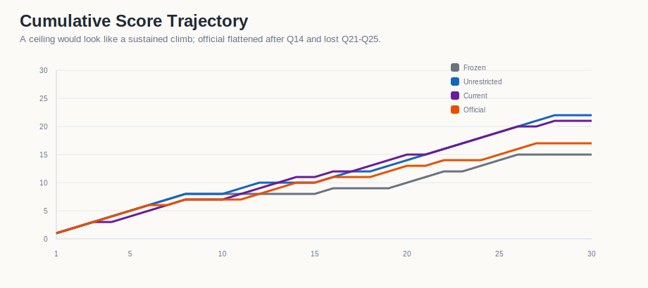

# Artifact 02 - Unrestricted Reference

This is the high-budget comparison artifact. It is the empirical ceiling in the
four-artifact set, not the operating point to optimize around.

| score | accuracy | mean tokens/problem | role in ledger |
| ---: | ---: | ---: | --- |
| 22/30 | 73.33% | 1,125,451 | high-budget reference ceiling |

## Analysis

The unrestricted run improved from Artifact 01 by 7 answers, reaching 22/30. It
also spent about 1.58x the tokens of the pruned baseline and about 8.75x the
tokens of Artifact 03. That tradeoff makes it the accuracy ceiling but not the
preferred efficiency point.

Its main value is comparative: any later compact controller run should be judged
against how close it gets to this ceiling while spending far fewer tokens.

## Data

- [`data/q1_q30_problem_results.csv`](data/q1_q30_problem_results.csv)
- [`data/q1_q30_summary_and_slices.csv`](data/q1_q30_summary_and_slices.csv)
- [`data/artifact02_vs_artifact01_q1_q30.csv`](data/artifact02_vs_artifact01_q1_q30.csv)
- [`data/cross_artifact_comparison_q1_q30.csv`](data/cross_artifact_comparison_q1_q30.csv)

## Visualizations

