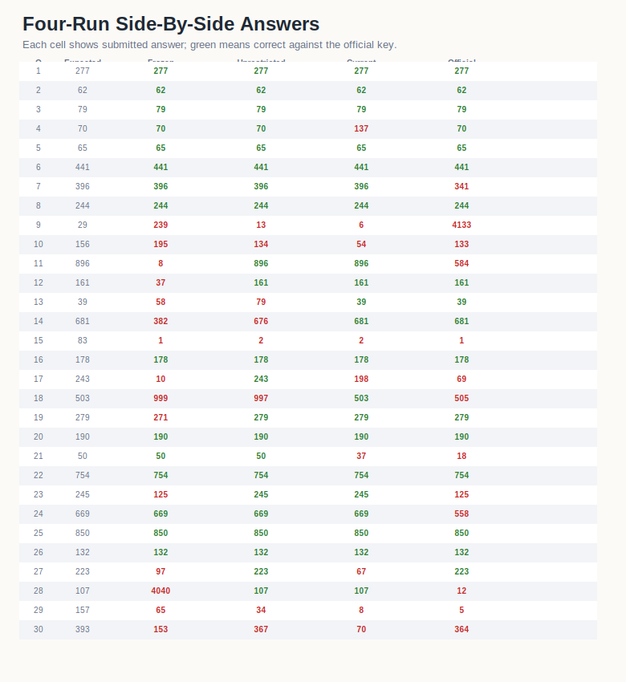

# Artifact 03 - April 27 Benchmarkgrade v0.2.3

This folder replaces the durable wording that previously depended on the label
"current". The raw tables retain the legacy key `current`, but this artifact is
named by date, number, and run identity.

| score | accuracy | mean tokens/problem | role in ledger |
| ---: | ---: | ---: | --- |
| 21/30 | 70.00% | 128,625 | compact benchmarkgrade controller result |

## Analysis

Artifact 03 is the strongest efficiency result in this set. It landed within one
answer of the unrestricted reference while using roughly 11.4% of the
unrestricted token budget. Against Artifact 01, it gained 6 answers while also
cutting mean tokens/problem from 711,100 to 128,625.

This is the correct durable claim: the April 27 benchmarkgrade controller showed
near-ceiling accuracy with a compact solve footprint. It should not be described
as "current" in the repository because a revision ledger is historical.

## Comparison

| comparison | result |
| --- | --- |
| vs Artifact 01 | +6 correct, lower token cost |
| vs Artifact 02 | -1 correct, much lower token cost |
| vs Artifact 04 | +4 correct overall |

Artifact 04 fixed Q4 and Q27 relative to this run, but lost Q7, Q11, Q18, Q23,
Q24, and Q28. That makes Artifact 03 the better full-run operating point in the
current evidence set.

## Data

- [`data/q1_q30_problem_results.csv`](data/q1_q30_problem_results.csv)
- [`data/q1_q30_summary_and_slices.csv`](data/q1_q30_summary_and_slices.csv)
- [`data/artifact03_vs_artifacts01_02_q1_q30.csv`](data/artifact03_vs_artifacts01_02_q1_q30.csv)
- [`data/cross_artifact_comparison_q1_q30.csv`](data/cross_artifact_comparison_q1_q30.csv)

## Visualizations

