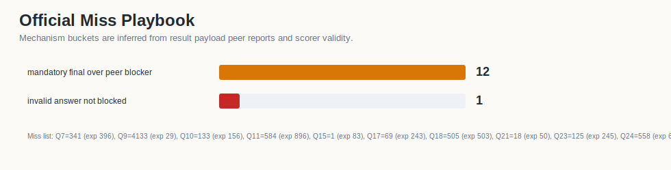
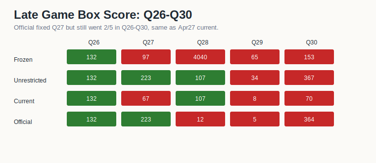
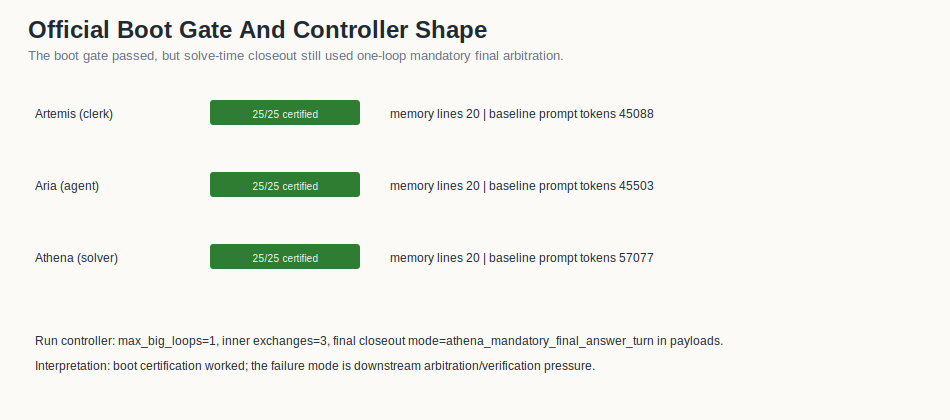

# Artifact 04 - April 28 RuntimeAtBoot v33 Experiment

This folder is the renamed April 28 RuntimeAtBoot experiment package. It should
not be treated as "official" in durable repository naming. It is a negative
diagnostic run plus the supporting boot/runtime evidence that explains what
changed and what failed.

| score | accuracy | mean tokens/problem | role in ledger |
| ---: | ---: | ---: | --- |
| 17/30 | 56.67% | 134,446 | RuntimeAtBoot transfer experiment |

## What Changed

The experiment added RuntimeAtBoot study/certification before the solve pass.
The intended shape was:

- study 100 boot records per role,
- certify boot memory before benchmark execution,
- capture a post-certification replay baseline,
- preserve the compact token footprint seen in Artifact 03,
- improve or at least preserve final answer quality.

## Expected Outcome

The expected outcome was a run at or above Artifact 03's 21/30, ideally with
recovered misses from the April 27 benchmarkgrade artifact and no regression in
final-answer validation.

## What Happened

The run landed at 17/30. It fixed Q4 and Q27 relative to Artifact 03, but lost
Q7, Q11, Q18, Q23, Q24, and Q28. Q9 also exposed answer-bound weakness by
submitting an invalid AIME-range answer. The result is therefore not a successful
RuntimeAtBoot transfer claim; it is evidence that boot certification alone did
not protect the final arbitration/control path.

## Interpretation

The useful conclusion is narrow and practical: the runtime layer can be loaded
and certified, but final answer validation and peer-disagreement handling still
need hard gates. The follow-up CB8 repair moves the study acknowledgement to a
clear sentinel (`BOOT_CERTIFIED`) and prevents a failed acknowledgement from
turning into a trusted baseline.

## Data

- [`data/q1_q30_problem_results.csv`](data/q1_q30_problem_results.csv)
- [`data/q1_q30_summary_and_slices.csv`](data/q1_q30_summary_and_slices.csv)
- [`data/artifact04_vs_artifact03_q1_q30.csv`](data/artifact04_vs_artifact03_q1_q30.csv)
- [`data/cross_artifact_comparison_q1_q30.csv`](data/cross_artifact_comparison_q1_q30.csv)
- [`data/runtime_at_boot_artifact_summary.csv`](data/runtime_at_boot_artifact_summary.csv)

## Visualizations

## Preserved Package Notes

The original runtime package files remain in this folder, including `ANALYSIS.md`,
`REPRODUCIBILITY.md`, `STORY.md`, `MANIFEST.md`, `APR28_RUNTIMEATBOOT_REGRESSION_NOTE.md`,
`runtime_at_boot/`, `code/`, `notebooks/`, and the copied four-run report. Those
files are retained as evidence, while this README is the durable entry point.
