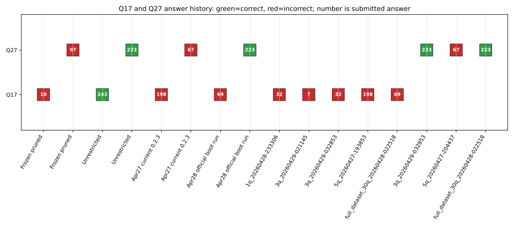
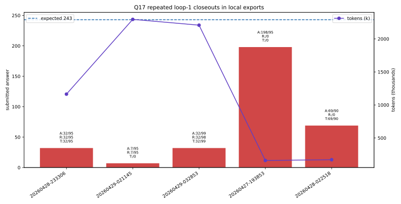
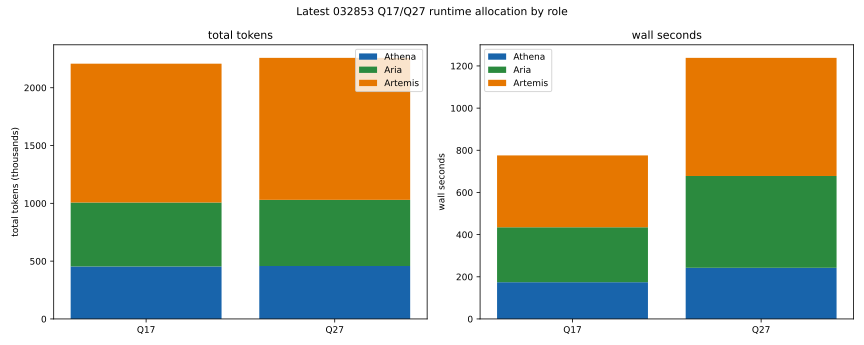
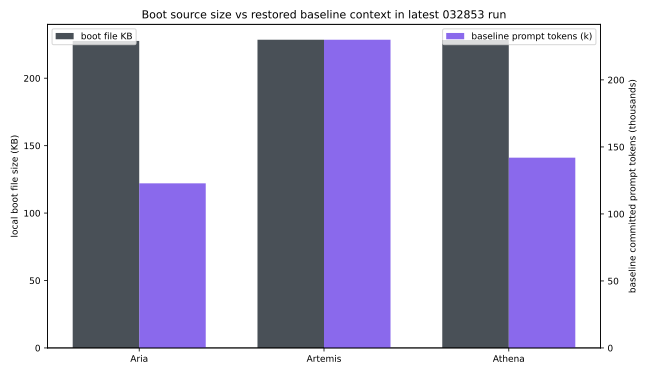

# Artifact 05: Q17/Q27 Transcript Diagnostics

Generated on 2026-04-29 from the local AIME export folder:

`N:\Research\colab_outputs\AIME-2026_export_explicit_problem_indices_3q_20260429-032853`

This artifact is a narrow transcript-analysis package. It does not revise the frozen paper source. It answers one diagnostic question: why did the latest selected run recover Q27 but still miss Q17, despite loop-1 internal closeout?

## Strict Score Verdict

Latest selected export `AIME-2026_export_explicit_problem_indices_3q_20260429-032853`:

- score: `2/3` (66.6667%)
- correct ids: `aime2025_01, aime2025_27`
- incorrect ids: `aime2025_17`
- Runtime-at-Boot passed: `True`

## Main Findings

1. Q17 is still wrong in the latest selected run. It submitted `32`; the strict key is `243`.
2. Q17 is the clean false-confidence case: internal `verified=True`, loop 1 closeout, all three visible candidates aligned on `32` in the latest selected run.
3. The existing four-artifact ledger shows Q17 correct only in the unrestricted reference artifact, not in the frozen pruned artifact. Frozen pruned submitted `10`; unrestricted submitted `243`.
4. Q27 is correctly recovered as `223`. The transcript shows a productive correction: an irrational-distance blocker led Athena to redo the center-distance geometry and obtain `RS = 175/48`, hence `175+48=223`.
5. The boot/runtime-token profile does not support a simple "Athena raw boot is much larger" explanation in this local export. The local boot files for Athena/Artemis/Aria are all about 228 KB, and Artemis has the largest restored baseline prompt-token footprint in the latest run.

## Figures

## Data Tables

- [`data/q17_q27_cross_run_matrix.csv`](data/q17_q27_cross_run_matrix.csv) - compact answer/correctness matrix across published ledger rows and local exports.
- [`data/q17_q27_colab_export_attempts.csv`](data/q17_q27_colab_export_attempts.csv) - per-export Q17/Q27 payload diagnostics from local `result_payloads`.
- [`data/q17_q27_four_artifact_extract.csv`](data/q17_q27_four_artifact_extract.csv) - Q17/Q27 rows from the existing four-artifact ledger.
- [`data/latest_032853_role_token_walltime.csv`](data/latest_032853_role_token_walltime.csv) - role token and wall-time allocation for Q1/Q17/Q27 in the latest selected run.
- [`data/latest_032853_boot_role_profile.csv`](data/latest_032853_boot_role_profile.csv) - boot-memory role profile from the latest selected run.
- [`data/SOURCE_MANIFEST.json`](data/SOURCE_MANIFEST.json) - local source paths used to derive this artifact.

## Transcript Notes

- [`excerpts/q17_transcript_diagnostic.md`](excerpts/q17_transcript_diagnostic.md)
- [`excerpts/q27_transcript_diagnostic.md`](excerpts/q27_transcript_diagnostic.md)

Full transcripts are referenced by local path in the data tables but are not republished in this artifact.
