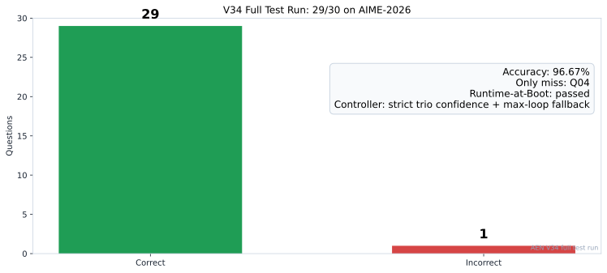
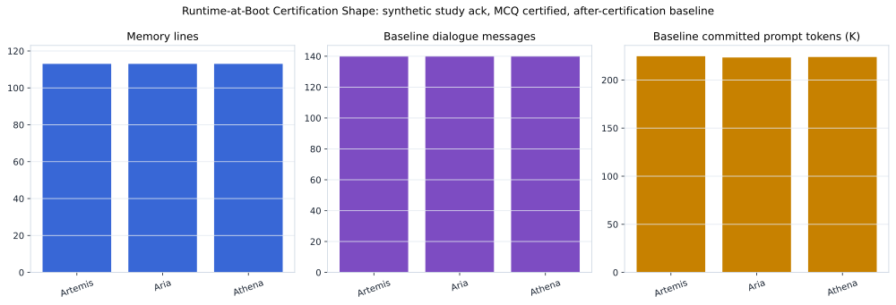
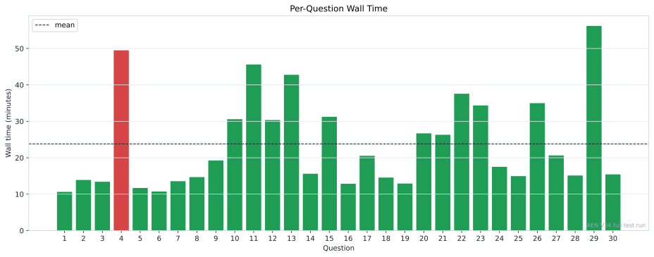
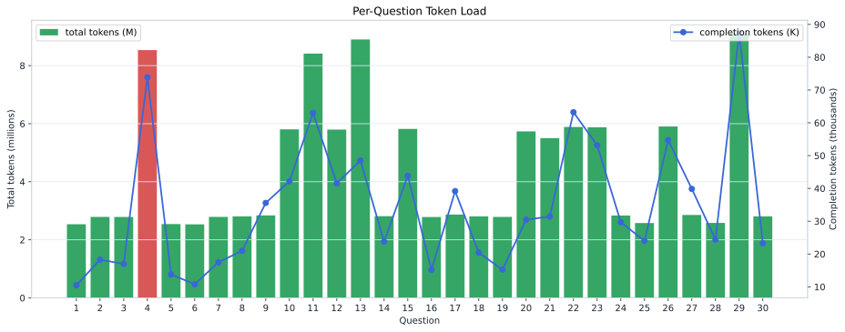
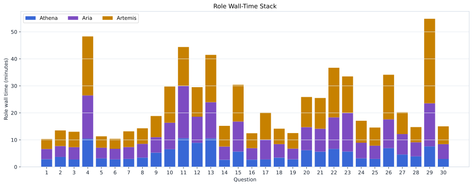
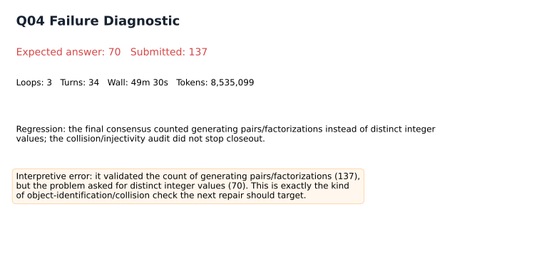

# V34 Full Test Run

This artifact is the full post-run analysis package for the April 29, 2026 V34 AIME-2026 run.
It is based on the Colab export at `N:\Research\colab_outputs\aime_2026_export_full_dataset_30q_20260429-090719` and the notebook `N:\Research\AENAIMO260_0_2_3_V34_NEXT_RUN.ipynb`.

**Correction / interpretation note:** V34 is an answer-aware Runtime-at-Boot repair replay, not a blind AIME solve. The transcripts show direct recall of exact boot answer anchors, including Q11's `Verified answer: 896`. Read the diagnostic: [V34 Context Recall Diagnostic](CONTEXT_RECALL_DIAGNOSTIC.md).

## Headline

V34 scored **29/30 (96.67%)** in an answer-aware Runtime-at-Boot repair replay. Runtime-at-Boot passed. The only miss was **Q04**, where the system closed on `137` while the expected distinct-integer answer was `70`. This score is evidence of boot-memory recall and architecture preservation, not an answer-free benchmark score.

| metric | value |
| --- | --- |
| Score | 29/30 |
| Accuracy | 96.67% |
| Miss | aime_2026_04 |
| Runtime-at-Boot | passed |
| Solve wall time | 11h 54m 11s |
| Runtime-at-Boot wall time | 56m 37s |
| End-to-end wall time | 12h 50m 48s |
| Total tokens | 130,647,799 |
| Mean tokens/question | 4,354,927 |
| Total turns | 542 |
| Loop distribution | L1: 18, L2: 8, L3: 4 |

## What Changed

- Runtime-at-Boot moved from model-generated boot-study acknowledgements to synthetic exact acknowledgement commits. This removed the boot-time thinking/echo loop while still inserting the study prompts and `BOOT_CERTIFIED` assistant turns into the session transcript.
- The V34 boot layer used the additive answer-aware repair dataset: 113 selected memory records per role, two study passes, 20 chunks per role, 40 synthetic study turns per role, then 30 MCQ certification probes per role.
- The captured baseline is after certification: 140 dialogue messages per role, with about 223k-225k committed prompt tokens restored before each benchmark question.
- The controller used strict trio-confidence closeout with exact integer agreement; max-loop best-confidence arbitration was only available after loop 3.
- Main solving/report budgets were 10k tokens per turn, final answer budget was 256 tokens, and each role had a 1.01M-token runtime context envelope.

## Expectation Versus Outcome

Expectation was that V34 would repair the 13 known Runtime-at-Boot v33 failures without reintroducing the boot-study hang. That mostly happened: all 13 targeted prior misses were repaired. The tradeoff was a new Q04 regression caused by a semantic object error, not by boot failure.

- Targeted prior failures repaired: **13/13**.
- Net change versus Artifact 04: **+12** questions.
- Fixed versus Artifact 04: Q07, Q09, Q10, Q11, Q15, Q17, Q18, Q21, Q23, Q24, Q28, Q29, Q30.
- Regressed versus Artifact 04: Q04.

## Full Run Tables

### Per-Question Summary

| q | answer | expected | ok | loops | turns | minutes | tokens_M | report |
| --- | --- | --- | --- | --- | --- | --- | --- | --- |
| Q01 | 277 | 277 | yes | 1 | 11 | 10.64 | 2.536 | [link](per_question_reports/q01_aime_2026_01.md) |
| Q02 | 62 | 62 | yes | 1 | 12 | 13.89 | 2.79 | [link](per_question_reports/q02_aime_2026_02.md) |
| Q03 | 79 | 79 | yes | 1 | 12 | 13.4 | 2.787 | [link](per_question_reports/q03_aime_2026_03.md) |
| Q04 | 137 | 70 | NO | 3 | 34 | 49.5 | 8.535 | [link](per_question_reports/q04_aime_2026_04.md) |
| Q05 | 65 | 65 | yes | 1 | 11 | 11.69 | 2.543 | [link](per_question_reports/q05_aime_2026_05.md) |
| Q06 | 441 | 441 | yes | 1 | 11 | 10.73 | 2.532 | [link](per_question_reports/q06_aime_2026_06.md) |
| Q07 | 396 | 396 | yes | 1 | 12 | 13.56 | 2.79 | [link](per_question_reports/q07_aime_2026_07.md) |
| Q08 | 244 | 244 | yes | 1 | 12 | 14.68 | 2.807 | [link](per_question_reports/q08_aime_2026_08.md) |
| Q09 | 29 | 29 | yes | 1 | 12 | 19.25 | 2.842 | [link](per_question_reports/q09_aime_2026_09.md) |
| Q10 | 156 | 156 | yes | 2 | 24 | 30.59 | 5.805 | [link](per_question_reports/q10_aime_2026_10.md) |
| Q11 | 896 | 896 | yes | 3 | 34 | 45.6 | 8.416 | [link](per_question_reports/q11_aime_2026_11.md) |
| Q12 | 161 | 161 | yes | 2 | 24 | 30.36 | 5.798 | [link](per_question_reports/q12_aime_2026_12.md) |
| Q13 | 39 | 39 | yes | 3 | 36 | 42.76 | 8.901 | [link](per_question_reports/q13_aime_2026_13.md) |
| Q14 | 681 | 681 | yes | 1 | 12 | 15.61 | 2.815 | [link](per_question_reports/q14_aime_2026_14.md) |
| Q15 | 83 | 83 | yes | 2 | 24 | 31.24 | 5.821 | [link](per_question_reports/q15_aime_2026_15.md) |
| Q16 | 178 | 178 | yes | 1 | 12 | 12.86 | 2.785 | [link](per_question_reports/q16_aime_2026_16.md) |
| Q17 | 243 | 243 | yes | 1 | 12 | 20.54 | 2.871 | [link](per_question_reports/q17_aime_2026_17.md) |
| Q18 | 503 | 503 | yes | 1 | 12 | 14.55 | 2.809 | [link](per_question_reports/q18_aime_2026_18.md) |
| Q19 | 279 | 279 | yes | 1 | 12 | 12.92 | 2.79 | [link](per_question_reports/q19_aime_2026_19.md) |
| Q20 | 190 | 190 | yes | 2 | 24 | 26.7 | 5.735 | [link](per_question_reports/q20_aime_2026_20.md) |
| Q21 | 50 | 50 | yes | 2 | 23 | 26.31 | 5.503 | [link](per_question_reports/q21_aime_2026_21.md) |
| Q22 | 754 | 754 | yes | 2 | 24 | 37.58 | 5.886 | [link](per_question_reports/q22_aime_2026_22.md) |
| Q23 | 245 | 245 | yes | 2 | 24 | 34.37 | 5.876 | [link](per_question_reports/q23_aime_2026_23.md) |
| Q24 | 669 | 669 | yes | 1 | 12 | 17.5 | 2.838 | [link](per_question_reports/q24_aime_2026_24.md) |
| Q25 | 850 | 850 | yes | 1 | 11 | 14.95 | 2.578 | [link](per_question_reports/q25_aime_2026_25.md) |
| Q26 | 132 | 132 | yes | 2 | 24 | 35.0 | 5.904 | [link](per_question_reports/q26_aime_2026_26.md) |
| Q27 | 223 | 223 | yes | 1 | 12 | 20.64 | 2.857 | [link](per_question_reports/q27_aime_2026_27.md) |
| Q28 | 107 | 107 | yes | 1 | 11 | 15.12 | 2.582 | [link](per_question_reports/q28_aime_2026_28.md) |
| Q29 | 157 | 157 | yes | 3 | 36 | 56.19 | 9.107 | [link](per_question_reports/q29_aime_2026_29.md) |
| Q30 | 393 | 393 | yes | 1 | 12 | 15.43 | 2.809 | [link](per_question_reports/q30_aime_2026_30.md) |

### Artifact Comparison

| artifact | score | accuracy | mean_tokens | mean_seconds |
| --- | --- | --- | --- | --- |
| Artifact 01 frozen pruned | 15/30 | 50.00% | 711,100 | 3m 03s |
| Artifact 02 unrestricted | 22/30 | 73.33% | 1,125,451 | 6m 20s |
| Artifact 03 Apr27 benchmarkgrade | 21/30 | 70.00% | 128,625 | 5m 44s |
| Artifact 04 Apr28 RAB v33 | 17/30 | 56.67% | 134,446 | 6m 25s |
| Artifact 06 V34 full test run | 29/30 | 96.67% | 4,354,927 | 23m 48s |

## Runtime-at-Boot

Runtime-at-Boot was structurally healthy in this run. The important architectural change is that the study acknowledgement was no longer generated by the model. It was committed synthetically into the session transcript, so boot memory was present without inviting a long thinking transcript during boot.

| role | status | memory_lines | chunks | passes | study_turns | ack_success | ack_mode | baseline_msgs | baseline_prompt_tokens |
| --- | --- | --- | --- | --- | --- | --- | --- | --- | --- |
| Artemis | certified | 113 | 20 | 2 | 40 | 40 | synthetic_exact_ack_session_commit | 140 | 224683 |
| Aria | certified | 113 | 20 | 2 | 40 | 40 | synthetic_exact_ack_session_commit | 140 | 223406 |
| Athena | certified | 113 | 20 | 2 | 40 | 40 | synthetic_exact_ack_session_commit | 140 | 223875 |

## Controller And Compute

The solve phase took **11h 54m 11s**. Runtime-at-Boot took **56m 37s** before the dataset run, for an approximate end-to-end runtime of **12h 50m 48s**. Total token traffic was **130,647,799** tokens, dominated by prompt tokens because each turn replayed the large post-certification memory baseline.

Closeout status counts: closed_out_strict_trio_confidence: 28, closed_out_max_loop_best_confidence_arbitration: 2. Loop counts: loop 1: 18, loop 2: 8, loop 3: 4.

## What Went Right

- The synthetic boot-study acknowledgement fixed the earlier boot failure mode: no generated thinking transcript was needed to study Runtime-at-Boot records.
- Every targeted V34 repair question landed correct, including the late hard failures Q28, Q29, and Q30.
- The stricter controller spent more work on difficult questions instead of prematurely closing on first-loop agreement. Q10, Q11, Q12, Q15, Q20, Q21, Q22, Q23, Q26, and Q29 all used extra loops or max-loop arbitration.
- The full architecture stayed coherent under a very large restored memory baseline: per-problem resets restored boot memory and preserved the after-certification transcript.

## What Went Wrong

- Q04 is a clean semantic-object failure. The model counted valid generating pairs/factorizations (`137`) rather than distinct integer values (`70`). The peers aligned around the wrong object and the collision/injectivity audit did not block closeout.
- Compute cost rose sharply. V34 is the highest-scoring run, but also far heavier than the earlier 21/30 efficiency artifact because the 223k-token boot baseline is replayed in every role session.
- Two correct questions closed by max-loop best-confidence arbitration, not strict trio-confidence. That is acceptable under the configured policy, but it marks a residual confidence/coordination ceiling.

## Where We Stand

Within this answer-aware repair-at-boot experiment, the observed ceiling moved to **29/30**. The remaining ceiling blocker is not general capacity; it is object identification under duplicate-generating maps. The next targeted repair should focus on distinct-value counting, collision checks, and explicit answer-object audits before confidence closeout.

This should not be described as a blind public benchmark score. V34 contains additive answer-aware repairs for known AIME-2026 failures, so the durable claim is architectural: the runtime can ingest a large repair memory, certify it, replay it per problem, and convert a 17/30 Runtime-at-Boot failure into a 29/30 full-run repair while leaving an auditable miss.

## Figures And Data

- Full figure index: [`VISUAL_INDEX.md`](VISUAL_INDEX.md)
- Per-question reports: [`per_question_reports/`](per_question_reports/)
- Derived tables: [`data/`](data/)
- Raw Colab export copy: [`raw_export/`](raw_export/)
- Source manifest: [`SOURCE_MANIFEST.csv`](SOURCE_MANIFEST.csv)

## Code Revisions

| component | revision |
| --- | --- |
| cb05_prompting | 2026-04-29-cb05-v1.4.4-adaptive-friction-session-prompts |
| cb07_5_dynamic | 2026-04-29-cb075-strict-confidence-loop-closeout-v1.5.2 |
| cb08_runtime | 2026-04-29-cb08-runtimeatboot-synthetic-study-ack-v1.5.8 |
| cb12_dataset | 2026-04-29-cb12-prompt-or-dataset-route-r2 |
| cb13_package | 2026-04-29-cb13-route-aware-score-package-r2 |

