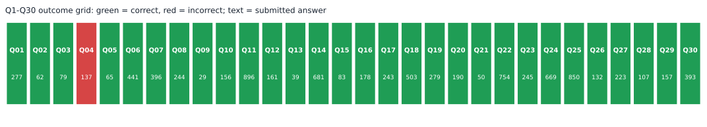
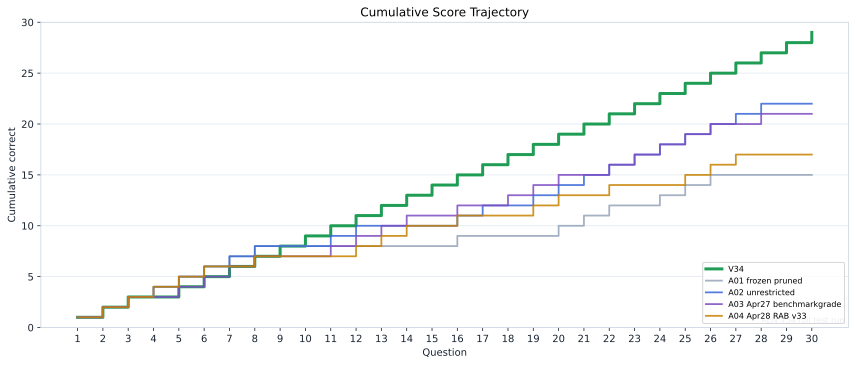
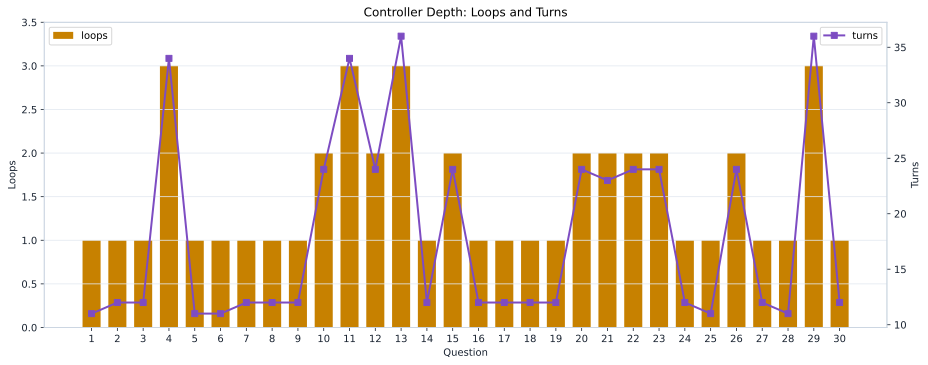
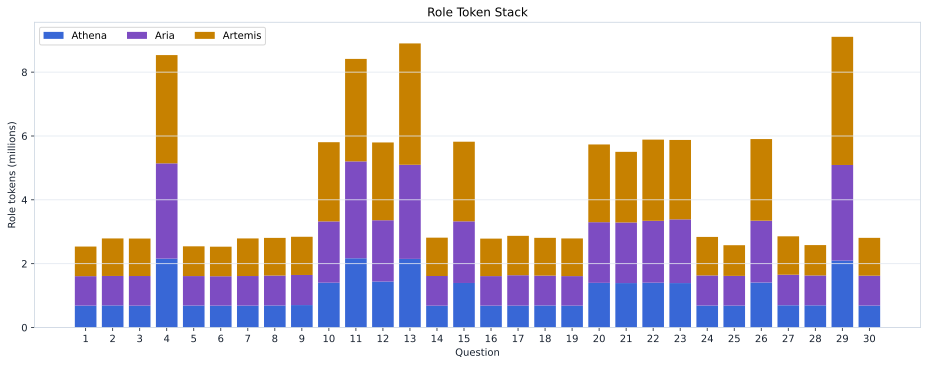
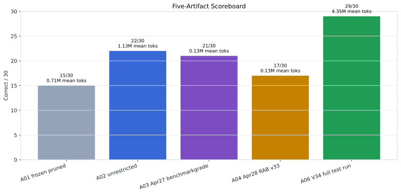
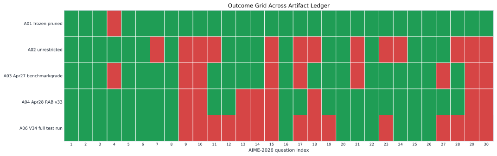
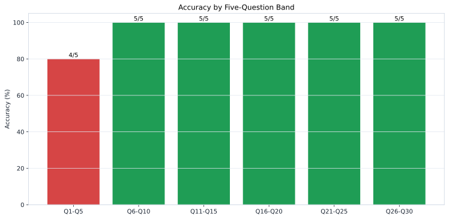
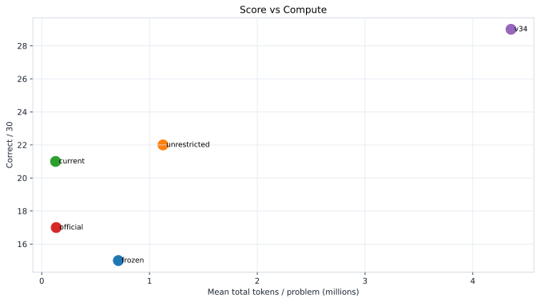
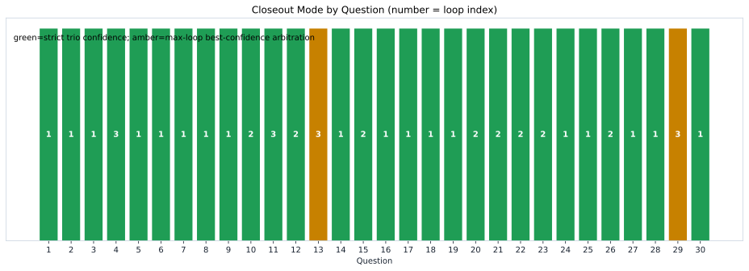
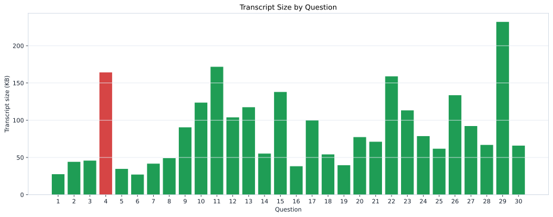

# V34 Visual Index

Every global figure is emitted as both SVG and PNG. Per-question profile figures are under `visualizations/questions/`.

## Headline Scoreboard

Correct/incorrect headline for the V34 run.

- SVG: [`01_headline_scoreboard.svg`](visualizations/01_headline_scoreboard.svg)
- PNG: [`01_headline_scoreboard.png`](visualizations/01_headline_scoreboard.png)

## Q1-Q30 Result Grid

Per-question outcome grid with submitted answers.

- SVG: [`02_q1_q30_result_grid.svg`](visualizations/02_q1_q30_result_grid.svg)
- PNG: [`02_q1_q30_result_grid.png`](visualizations/02_q1_q30_result_grid.png)

## Cumulative Score Trajectory

V34 cumulative score against prior artifact trajectories.

- SVG: [`03_cumulative_score_trajectory.svg`](visualizations/03_cumulative_score_trajectory.svg)
- PNG: [`03_cumulative_score_trajectory.png`](visualizations/03_cumulative_score_trajectory.png)

## Wall Time by Question

Per-question solve wall time; miss shown in red.

- SVG: [`04_wall_time_by_question.svg`](visualizations/04_wall_time_by_question.svg)
- PNG: [`04_wall_time_by_question.png`](visualizations/04_wall_time_by_question.png)

## Token Load by Question

Total and completion-token load per question.

- SVG: [`05_tokens_by_question.svg`](visualizations/05_tokens_by_question.svg)
- PNG: [`05_tokens_by_question.png`](visualizations/05_tokens_by_question.png)

## Loops and Turns

Controller loop count and total turns per question.

- SVG: [`06_loops_turns_by_question.svg`](visualizations/06_loops_turns_by_question.svg)
- PNG: [`06_loops_turns_by_question.png`](visualizations/06_loops_turns_by_question.png)

## Role Wall Time

Stacked wall time by role for each question.

- SVG: [`07_role_wall_time_stacked.svg`](visualizations/07_role_wall_time_stacked.svg)
- PNG: [`07_role_wall_time_stacked.png`](visualizations/07_role_wall_time_stacked.png)

## Role Tokens

Stacked total tokens by role for each question.

- SVG: [`08_role_tokens_stacked.svg`](visualizations/08_role_tokens_stacked.svg)
- PNG: [`08_role_tokens_stacked.png`](visualizations/08_role_tokens_stacked.png)

## Five Artifact Scoreboard

Score and mean-token comparison across the artifact ledger.

- SVG: [`09_five_artifact_scoreboard.svg`](visualizations/09_five_artifact_scoreboard.svg)
- PNG: [`09_five_artifact_scoreboard.png`](visualizations/09_five_artifact_scoreboard.png)

## Artifact Outcome Grid

Correct/incorrect grid for V34 against the prior four artifacts.

- SVG: [`10_artifact_delta_grid.svg`](visualizations/10_artifact_delta_grid.svg)
- PNG: [`10_artifact_delta_grid.png`](visualizations/10_artifact_delta_grid.png)

## Runtime-at-Boot Certification

Role-level Runtime-at-Boot memory, baseline, and prompt-token profile.

- SVG: [`11_runtime_at_boot_certification.svg`](visualizations/11_runtime_at_boot_certification.svg)
- PNG: [`11_runtime_at_boot_certification.png`](visualizations/11_runtime_at_boot_certification.png)

## Q04 Failure Diagnostic

The lone V34 miss and its failure mode.

- SVG: [`12_q04_failure_diagnostic.svg`](visualizations/12_q04_failure_diagnostic.svg)
- PNG: [`12_q04_failure_diagnostic.png`](visualizations/12_q04_failure_diagnostic.png)

## Band Accuracy

Accuracy by five-question band.

- SVG: [`13_band_accuracy.svg`](visualizations/13_band_accuracy.svg)
- PNG: [`13_band_accuracy.png`](visualizations/13_band_accuracy.png)

## Score vs Compute

Accuracy and token cost across the artifact ledger.

- SVG: [`14_score_vs_compute.svg`](visualizations/14_score_vs_compute.svg)
- PNG: [`14_score_vs_compute.png`](visualizations/14_score_vs_compute.png)

## Closeout Status

Strict versus max-loop closeout modes by question.

- SVG: [`15_closeout_status_grid.svg`](visualizations/15_closeout_status_grid.svg)
- PNG: [`15_closeout_status_grid.png`](visualizations/15_closeout_status_grid.png)

## Transcript Size

Transcript file size by question.

- SVG: [`16_transcript_size_by_question.svg`](visualizations/16_transcript_size_by_question.svg)
- PNG: [`16_transcript_size_by_question.png`](visualizations/16_transcript_size_by_question.png)

## Per-Question Profiles

| question | SVG | PNG |
| --- | --- | --- |
| Q01 | [`q01_profile.svg`](visualizations/questions/q01_profile.svg) | [`q01_profile.png`](visualizations/questions/q01_profile.png) |
| Q02 | [`q02_profile.svg`](visualizations/questions/q02_profile.svg) | [`q02_profile.png`](visualizations/questions/q02_profile.png) |
| Q03 | [`q03_profile.svg`](visualizations/questions/q03_profile.svg) | [`q03_profile.png`](visualizations/questions/q03_profile.png) |
| Q04 | [`q04_profile.svg`](visualizations/questions/q04_profile.svg) | [`q04_profile.png`](visualizations/questions/q04_profile.png) |
| Q05 | [`q05_profile.svg`](visualizations/questions/q05_profile.svg) | [`q05_profile.png`](visualizations/questions/q05_profile.png) |
| Q06 | [`q06_profile.svg`](visualizations/questions/q06_profile.svg) | [`q06_profile.png`](visualizations/questions/q06_profile.png) |
| Q07 | [`q07_profile.svg`](visualizations/questions/q07_profile.svg) | [`q07_profile.png`](visualizations/questions/q07_profile.png) |
| Q08 | [`q08_profile.svg`](visualizations/questions/q08_profile.svg) | [`q08_profile.png`](visualizations/questions/q08_profile.png) |
| Q09 | [`q09_profile.svg`](visualizations/questions/q09_profile.svg) | [`q09_profile.png`](visualizations/questions/q09_profile.png) |
| Q10 | [`q10_profile.svg`](visualizations/questions/q10_profile.svg) | [`q10_profile.png`](visualizations/questions/q10_profile.png) |
| Q11 | [`q11_profile.svg`](visualizations/questions/q11_profile.svg) | [`q11_profile.png`](visualizations/questions/q11_profile.png) |
| Q12 | [`q12_profile.svg`](visualizations/questions/q12_profile.svg) | [`q12_profile.png`](visualizations/questions/q12_profile.png) |
| Q13 | [`q13_profile.svg`](visualizations/questions/q13_profile.svg) | [`q13_profile.png`](visualizations/questions/q13_profile.png) |
| Q14 | [`q14_profile.svg`](visualizations/questions/q14_profile.svg) | [`q14_profile.png`](visualizations/questions/q14_profile.png) |
| Q15 | [`q15_profile.svg`](visualizations/questions/q15_profile.svg) | [`q15_profile.png`](visualizations/questions/q15_profile.png) |
| Q16 | [`q16_profile.svg`](visualizations/questions/q16_profile.svg) | [`q16_profile.png`](visualizations/questions/q16_profile.png) |
| Q17 | [`q17_profile.svg`](visualizations/questions/q17_profile.svg) | [`q17_profile.png`](visualizations/questions/q17_profile.png) |
| Q18 | [`q18_profile.svg`](visualizations/questions/q18_profile.svg) | [`q18_profile.png`](visualizations/questions/q18_profile.png) |
| Q19 | [`q19_profile.svg`](visualizations/questions/q19_profile.svg) | [`q19_profile.png`](visualizations/questions/q19_profile.png) |
| Q20 | [`q20_profile.svg`](visualizations/questions/q20_profile.svg) | [`q20_profile.png`](visualizations/questions/q20_profile.png) |
| Q21 | [`q21_profile.svg`](visualizations/questions/q21_profile.svg) | [`q21_profile.png`](visualizations/questions/q21_profile.png) |
| Q22 | [`q22_profile.svg`](visualizations/questions/q22_profile.svg) | [`q22_profile.png`](visualizations/questions/q22_profile.png) |
| Q23 | [`q23_profile.svg`](visualizations/questions/q23_profile.svg) | [`q23_profile.png`](visualizations/questions/q23_profile.png) |
| Q24 | [`q24_profile.svg`](visualizations/questions/q24_profile.svg) | [`q24_profile.png`](visualizations/questions/q24_profile.png) |
| Q25 | [`q25_profile.svg`](visualizations/questions/q25_profile.svg) | [`q25_profile.png`](visualizations/questions/q25_profile.png) |
| Q26 | [`q26_profile.svg`](visualizations/questions/q26_profile.svg) | [`q26_profile.png`](visualizations/questions/q26_profile.png) |
| Q27 | [`q27_profile.svg`](visualizations/questions/q27_profile.svg) | [`q27_profile.png`](visualizations/questions/q27_profile.png) |
| Q28 | [`q28_profile.svg`](visualizations/questions/q28_profile.svg) | [`q28_profile.png`](visualizations/questions/q28_profile.png) |
| Q29 | [`q29_profile.svg`](visualizations/questions/q29_profile.svg) | [`q29_profile.png`](visualizations/questions/q29_profile.png) |
| Q30 | [`q30_profile.svg`](visualizations/questions/q30_profile.svg) | [`q30_profile.png`](visualizations/questions/q30_profile.png) |
