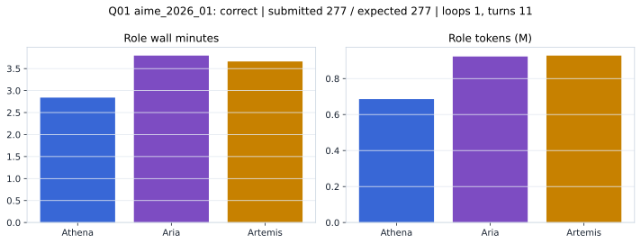

# Q01 aime_2026_01 Report

Outcome: **correct**. Submitted `277`; expected `277`.

## Metrics

| metric | value |
| --- | --- |
| Submitted | 277 |
| Expected | 277 |
| Outcome | correct |
| Status | closed_out_strict_trio_confidence |
| Loops | 1 |
| Turns | 11 |
| Wall time | 10m 39s |
| Total tokens | 2,536,058 |
| Completion tokens | 10,477 |
| Targeted V34 repair question | False |

## Role Runtime

| role | turns | wall_seconds | prompt_tokens | completion_tokens | total_tokens |
| --- | --- | --- | --- | --- | --- |
| Aria | 4 | 227.7126 | 918570 | 3976 | 922546 |
| Artemis | 4 | 219.6948 | 924088 | 3437 | 927525 |
| Athena | 3 | 170.4213 | 682923 | 3064 | 685987 |

## Final Candidate State

| role | candidate | confidence |
| --- | --- | --- |
| Athena | 277 | 100 |
| Aria | 277 | 100 |
| Artemis | 277 | 92 |

## Artifact Comparison

| artifact | answer | correct | tokens |
| --- | --- | --- | --- |
| Artifact 01 frozen pruned | 277 | True | 695,404 |
| Artifact 02 unrestricted | 277 | True | 1,049,170 |
| Artifact 03 Apr27 benchmarkgrade | 277 | True | 98,267 |
| Artifact 04 Apr28 RAB v33 | 277 | True | 105,380 |
| Artifact 06 V34 full test run | 277 | True | 2,536,058 |

## Diagnostic

Stable correct closeout.

## Source

- Transcript: [`raw_export/transcripts/aime_2026_01.txt`](../raw_export/transcripts/aime_2026_01.txt)
- Result payload: [`raw_export/result_payloads/aime_2026_01.json`](../raw_export/result_payloads/aime_2026_01.json)
