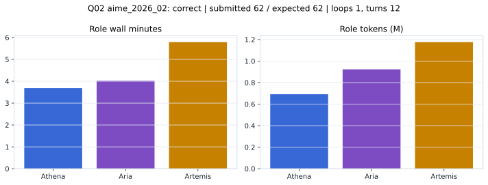

# Q02 aime_2026_02 Report

Outcome: **correct**. Submitted `62`; expected `62`.

## Metrics

| metric | value |
| --- | --- |
| Submitted | 62 |
| Expected | 62 |
| Outcome | correct |
| Status | closed_out_strict_trio_confidence |
| Loops | 1 |
| Turns | 12 |
| Wall time | 13m 54s |
| Total tokens | 2,790,160 |
| Completion tokens | 18,278 |
| Targeted V34 repair question | False |

## Role Runtime

| role | turns | wall_seconds | prompt_tokens | completion_tokens | total_tokens |
| --- | --- | --- | --- | --- | --- |
| Aria | 4 | 241.6676 | 918332 | 4746 | 923078 |
| Artemis | 5 | 347.2201 | 1167782 | 7715 | 1175497 |
| Athena | 3 | 221.1155 | 685768 | 5817 | 691585 |

## Final Candidate State

| role | candidate | confidence |
| --- | --- | --- |
| Athena | 62 | 100 |
| Aria | 62 | 100 |
| Artemis | 62 | 100 |

## Artifact Comparison

| artifact | answer | correct | tokens |
| --- | --- | --- | --- |
| Artifact 01 frozen pruned | 62 | True | 710,845 |
| Artifact 02 unrestricted | 62 | True | 1,074,559 |
| Artifact 03 Apr27 benchmarkgrade | 62 | True | 117,945 |
| Artifact 04 Apr28 RAB v33 | 62 | True | 135,253 |
| Artifact 06 V34 full test run | 62 | True | 2,790,160 |

## Diagnostic

Stable correct closeout.

## Source

- Transcript: [`raw_export/transcripts/aime_2026_02.txt`](../raw_export/transcripts/aime_2026_02.txt)
- Result payload: [`raw_export/result_payloads/aime_2026_02.json`](../raw_export/result_payloads/aime_2026_02.json)
