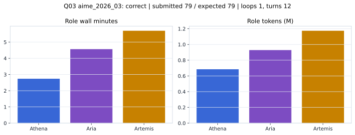

# Q03 aime_2026_03 Report

Outcome: **correct**. Submitted `79`; expected `79`.

## Metrics

| metric | value |
| --- | --- |
| Submitted | 79 |
| Expected | 79 |
| Outcome | correct |
| Status | closed_out_strict_trio_confidence |
| Loops | 1 |
| Turns | 12 |
| Wall time | 13m 24s |
| Total tokens | 2,786,781 |
| Completion tokens | 17,003 |
| Targeted V34 repair question | False |

## Role Runtime

| role | turns | wall_seconds | prompt_tokens | completion_tokens | total_tokens |
| --- | --- | --- | --- | --- | --- |
| Aria | 4 | 273.96 | 922007 | 6467 | 928474 |
| Artemis | 5 | 342.0354 | 1166229 | 7793 | 1174022 |
| Athena | 3 | 164.3403 | 681542 | 2743 | 684285 |

## Final Candidate State

| role | candidate | confidence |
| --- | --- | --- |
| Athena | 79 | 98 |
| Aria | 79 | 98 |
| Artemis | 79 | 92 |

## Artifact Comparison

| artifact | answer | correct | tokens |
| --- | --- | --- | --- |
| Artifact 01 frozen pruned | 79 | True | 702,855 |
| Artifact 02 unrestricted | 79 | True | 1,031,930 |
| Artifact 03 Apr27 benchmarkgrade | 79 | True | 114,524 |
| Artifact 04 Apr28 RAB v33 | 79 | True | 110,137 |
| Artifact 06 V34 full test run | 79 | True | 2,786,781 |

## Diagnostic

Stable correct closeout.

## Source

- Transcript: [`raw_export/transcripts/aime_2026_03.txt`](../raw_export/transcripts/aime_2026_03.txt)
- Result payload: [`raw_export/result_payloads/aime_2026_03.json`](../raw_export/result_payloads/aime_2026_03.json)
