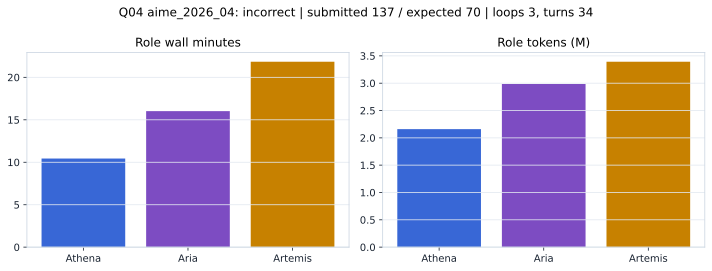

# Q04 aime_2026_04 Report

Outcome: **incorrect**. Submitted `137`; expected `70`.

## Metrics

| metric | value |
| --- | --- |
| Submitted | 137 |
| Expected | 70 |
| Outcome | incorrect |
| Status | closed_out_strict_trio_confidence |
| Loops | 3 |
| Turns | 34 |
| Wall time | 49m 30s |
| Total tokens | 8,535,099 |
| Completion tokens | 73,871 |
| Targeted V34 repair question | False |

## Role Runtime

| role | turns | wall_seconds | prompt_tokens | completion_tokens | total_tokens |
| --- | --- | --- | --- | --- | --- |
| Aria | 12 | 961.1051 | 2961467 | 23277 | 2984744 |
| Artemis | 13 | 1310.1733 | 3354904 | 36814 | 3391718 |
| Athena | 9 | 626.345 | 2144857 | 13780 | 2158637 |

## Final Candidate State

| role | candidate | confidence |
| --- | --- | --- |
| Athena | 137 | 100 |
| Aria | 137 | 100 |
| Artemis | 137 | 92 |

## Artifact Comparison

| artifact | answer | correct | tokens |
| --- | --- | --- | --- |
| Artifact 01 frozen pruned | 70 | True | 699,345 |
| Artifact 02 unrestricted | 70 | True | 1,038,493 |
| Artifact 03 Apr27 benchmarkgrade | 137 |  | 99,911 |
| Artifact 04 Apr28 RAB v33 | 70 | True | 111,291 |
| Artifact 06 V34 full test run | 137 |  | 8,535,099 |

## Diagnostic

Regression: the final consensus counted generating pairs/factorizations instead of distinct integer values; the collision/injectivity audit did not stop closeout.

## Source

- Transcript: [`raw_export/transcripts/aime_2026_04.txt`](../raw_export/transcripts/aime_2026_04.txt)
- Result payload: [`raw_export/result_payloads/aime_2026_04.json`](../raw_export/result_payloads/aime_2026_04.json)
