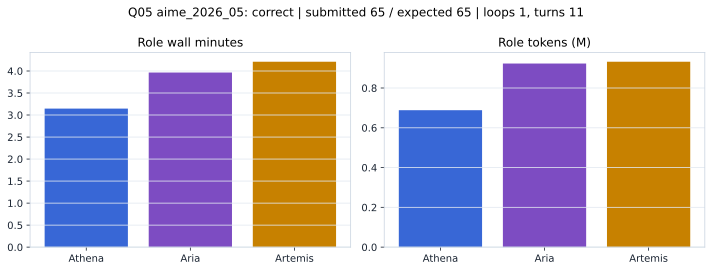

# Q05 aime_2026_05 Report

Outcome: **correct**. Submitted `65`; expected `65`.

## Metrics

| metric | value |
| --- | --- |
| Submitted | 65 |
| Expected | 65 |
| Outcome | correct |
| Status | closed_out_strict_trio_confidence |
| Loops | 1 |
| Turns | 11 |
| Wall time | 11m 41s |
| Total tokens | 2,543,189 |
| Completion tokens | 13,757 |
| Targeted V34 repair question | False |

## Role Runtime

| role | turns | wall_seconds | prompt_tokens | completion_tokens | total_tokens |
| --- | --- | --- | --- | --- | --- |
| Aria | 4 | 237.8373 | 918453 | 4515 | 922968 |
| Artemis | 4 | 252.5433 | 926720 | 5194 | 931914 |
| Athena | 3 | 188.7 | 684259 | 4048 | 688307 |

## Final Candidate State

| role | candidate | confidence |
| --- | --- | --- |
| Athena | 65 | 100 |
| Aria | 65 | 100 |
| Artemis | 65 | 92 |

## Artifact Comparison

| artifact | answer | correct | tokens |
| --- | --- | --- | --- |
| Artifact 01 frozen pruned | 65 | True | 716,821 |
| Artifact 02 unrestricted | 65 | True | 1,035,256 |
| Artifact 03 Apr27 benchmarkgrade | 65 | True | 95,915 |
| Artifact 04 Apr28 RAB v33 | 65 | True | 116,443 |
| Artifact 06 V34 full test run | 65 | True | 2,543,189 |

## Diagnostic

Stable correct closeout.

## Source

- Transcript: [`raw_export/transcripts/aime_2026_05.txt`](../raw_export/transcripts/aime_2026_05.txt)
- Result payload: [`raw_export/result_payloads/aime_2026_05.json`](../raw_export/result_payloads/aime_2026_05.json)
