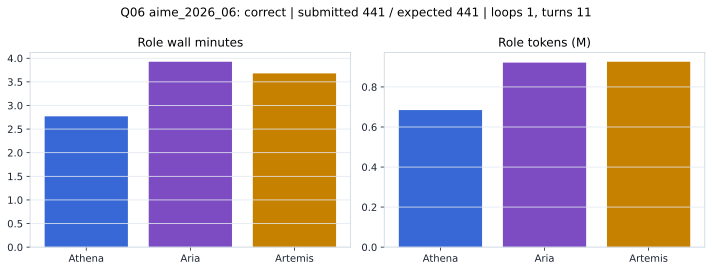

# Q06 aime_2026_06 Report

Outcome: **correct**. Submitted `441`; expected `441`.

## Metrics

| metric | value |
| --- | --- |
| Submitted | 441 |
| Expected | 441 |
| Outcome | correct |
| Status | closed_out_strict_trio_confidence |
| Loops | 1 |
| Turns | 11 |
| Wall time | 10m 44s |
| Total tokens | 2,531,716 |
| Completion tokens | 10,788 |
| Targeted V34 repair question | False |

## Role Runtime

| role | turns | wall_seconds | prompt_tokens | completion_tokens | total_tokens |
| --- | --- | --- | --- | --- | --- |
| Aria | 4 | 235.5176 | 917075 | 4421 | 921496 |
| Artemis | 4 | 220.7794 | 922168 | 3520 | 925688 |
| Athena | 3 | 166.2003 | 681685 | 2847 | 684532 |

## Final Candidate State

| role | candidate | confidence |
| --- | --- | --- |
| Athena | 441 | 100 |
| Aria | 441 | 100 |
| Artemis | 441 | 92 |

## Artifact Comparison

| artifact | answer | correct | tokens |
| --- | --- | --- | --- |
| Artifact 01 frozen pruned | 441 | True | 697,554 |
| Artifact 02 unrestricted | 441 | True | 1,055,694 |
| Artifact 03 Apr27 benchmarkgrade | 441 | True | 111,256 |
| Artifact 04 Apr28 RAB v33 | 441 | True | 110,072 |
| Artifact 06 V34 full test run | 441 | True | 2,531,716 |

## Diagnostic

Stable correct closeout.

## Source

- Transcript: [`raw_export/transcripts/aime_2026_06.txt`](../raw_export/transcripts/aime_2026_06.txt)
- Result payload: [`raw_export/result_payloads/aime_2026_06.json`](../raw_export/result_payloads/aime_2026_06.json)
