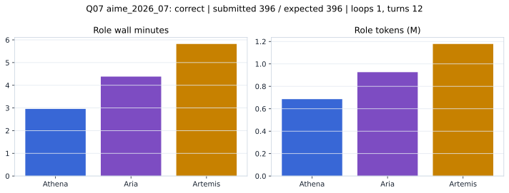

# Q07 aime_2026_07 Report

Outcome: **correct**. Submitted `396`; expected `396`.

## Metrics

| metric | value |
| --- | --- |
| Submitted | 396 |
| Expected | 396 |
| Outcome | correct |
| Status | closed_out_strict_trio_confidence |
| Loops | 1 |
| Turns | 12 |
| Wall time | 13m 34s |
| Total tokens | 2,790,287 |
| Completion tokens | 17,488 |
| Targeted V34 repair question | True |

## Role Runtime

| role | turns | wall_seconds | prompt_tokens | completion_tokens | total_tokens |
| --- | --- | --- | --- | --- | --- |
| Aria | 4 | 263.0247 | 920588 | 5894 | 926482 |
| Artemis | 5 | 349.1666 | 1169640 | 8138 | 1177778 |
| Athena | 3 | 177.4667 | 682571 | 3456 | 686027 |

## Final Candidate State

| role | candidate | confidence |
| --- | --- | --- |
| Athena | 396 | 100 |
| Aria | 396 | 100 |
| Artemis | 396 | 100 |

## Artifact Comparison

| artifact | answer | correct | tokens |
| --- | --- | --- | --- |
| Artifact 01 frozen pruned | 396 | True | 709,711 |
| Artifact 02 unrestricted | 396 | True | 1,068,798 |
| Artifact 03 Apr27 benchmarkgrade | 396 | True | 94,277 |
| Artifact 04 Apr28 RAB v33 | 341 |  | 99,059 |
| Artifact 06 V34 full test run | 396 | True | 2,790,287 |

## Diagnostic

Targeted V34 Runtime-at-Boot repair succeeded on a prior miss.

## Source

- Transcript: [`raw_export/transcripts/aime_2026_07.txt`](../raw_export/transcripts/aime_2026_07.txt)
- Result payload: [`raw_export/result_payloads/aime_2026_07.json`](../raw_export/result_payloads/aime_2026_07.json)
