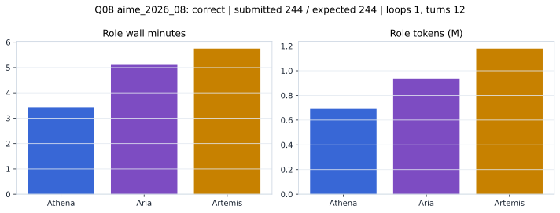

# Q08 aime_2026_08 Report

Outcome: **correct**. Submitted `244`; expected `244`.

## Metrics

| metric | value |
| --- | --- |
| Submitted | 244 |
| Expected | 244 |
| Outcome | correct |
| Status | closed_out_strict_trio_confidence |
| Loops | 1 |
| Turns | 12 |
| Wall time | 14m 41s |
| Total tokens | 2,807,431 |
| Completion tokens | 20,975 |
| Targeted V34 repair question | False |

## Role Runtime

| role | turns | wall_seconds | prompt_tokens | completion_tokens | total_tokens |
| --- | --- | --- | --- | --- | --- |
| Aria | 4 | 306.2386 | 929381 | 8116 | 937497 |
| Artemis | 5 | 344.9139 | 1171799 | 7860 | 1179659 |
| Athena | 3 | 206.1103 | 685276 | 4999 | 690275 |

## Final Candidate State

| role | candidate | confidence |
| --- | --- | --- |
| Athena | 244 | 99 |
| Aria | 244 | 99 |
| Artemis | 244 | 99 |

## Artifact Comparison

| artifact | answer | correct | tokens |
| --- | --- | --- | --- |
| Artifact 01 frozen pruned | 244 | True | 703,053 |
| Artifact 02 unrestricted | 244 | True | 1,127,006 |
| Artifact 03 Apr27 benchmarkgrade | 244 | True | 125,208 |
| Artifact 04 Apr28 RAB v33 | 244 | True | 105,509 |
| Artifact 06 V34 full test run | 244 | True | 2,807,431 |

## Diagnostic

Stable correct closeout.

## Source

- Transcript: [`raw_export/transcripts/aime_2026_08.txt`](../raw_export/transcripts/aime_2026_08.txt)
- Result payload: [`raw_export/result_payloads/aime_2026_08.json`](../raw_export/result_payloads/aime_2026_08.json)
