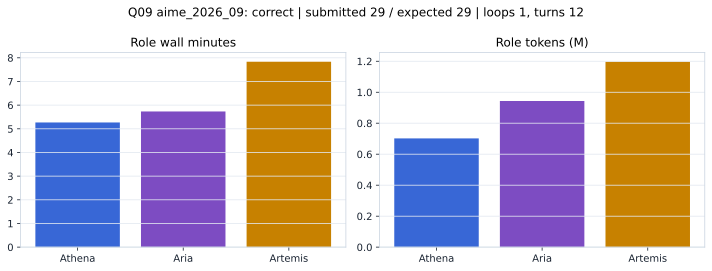

# Q09 aime_2026_09 Report

Outcome: **correct**. Submitted `29`; expected `29`.

## Metrics

| metric | value |
| --- | --- |
| Submitted | 29 |
| Expected | 29 |
| Outcome | correct |
| Status | closed_out_strict_trio_confidence |
| Loops | 1 |
| Turns | 12 |
| Wall time | 19m 15s |
| Total tokens | 2,842,327 |
| Completion tokens | 35,581 |
| Targeted V34 repair question | True |

## Role Runtime

| role | turns | wall_seconds | prompt_tokens | completion_tokens | total_tokens |
| --- | --- | --- | --- | --- | --- |
| Aria | 4 | 343.9344 | 933502 | 10117 | 943619 |
| Artemis | 5 | 469.9392 | 1182314 | 14506 | 1196820 |
| Athena | 3 | 316.1006 | 690930 | 10958 | 701888 |

## Final Candidate State

| role | candidate | confidence |
| --- | --- | --- |
| Athena | 29 | 100 |
| Aria | 29 | 100 |
| Artemis | 29 | 100 |

## Artifact Comparison

| artifact | answer | correct | tokens |
| --- | --- | --- | --- |
| Artifact 01 frozen pruned | 239 |  | 719,314 |
| Artifact 02 unrestricted | 13 |  | 1,155,566 |
| Artifact 03 Apr27 benchmarkgrade | 6 |  | 152,775 |
| Artifact 04 Apr28 RAB v33 | 4133 |  | 170,542 |
| Artifact 06 V34 full test run | 29 | True | 2,842,327 |

## Diagnostic

Targeted V34 Runtime-at-Boot repair succeeded on a prior miss.

## Source

- Transcript: [`raw_export/transcripts/aime_2026_09.txt`](../raw_export/transcripts/aime_2026_09.txt)
- Result payload: [`raw_export/result_payloads/aime_2026_09.json`](../raw_export/result_payloads/aime_2026_09.json)
