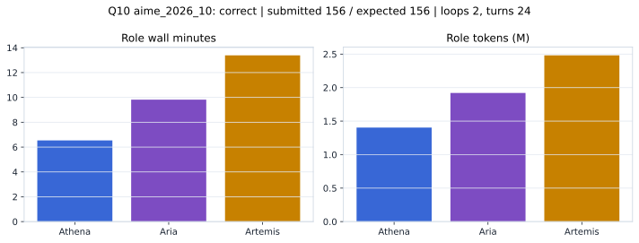

# Q10 aime_2026_10 Report

Outcome: **correct**. Submitted `156`; expected `156`.

## Metrics

| metric | value |
| --- | --- |
| Submitted | 156 |
| Expected | 156 |
| Outcome | correct |
| Status | closed_out_strict_trio_confidence |
| Loops | 2 |
| Turns | 24 |
| Wall time | 30m 35s |
| Total tokens | 5,805,435 |
| Completion tokens | 42,194 |
| Targeted V34 repair question | True |

## Role Runtime

| role | turns | wall_seconds | prompt_tokens | completion_tokens | total_tokens |
| --- | --- | --- | --- | --- | --- |
| Aria | 8 | 589.2819 | 1906359 | 14047 | 1920406 |
| Artemis | 10 | 803.054 | 2461465 | 19708 | 2481173 |
| Athena | 6 | 392.289 | 1395417 | 8439 | 1403856 |

## Final Candidate State

| role | candidate | confidence |
| --- | --- | --- |
| Athena | 156 | 98 |
| Aria | 156 | 98 |
| Artemis | 156 | 95 |

## Artifact Comparison

| artifact | answer | correct | tokens |
| --- | --- | --- | --- |
| Artifact 01 frozen pruned | 195 |  | 719,486 |
| Artifact 02 unrestricted | 134 |  | 1,176,005 |
| Artifact 03 Apr27 benchmarkgrade | 54 |  | 142,654 |
| Artifact 04 Apr28 RAB v33 | 133 |  | 174,336 |
| Artifact 06 V34 full test run | 156 | True | 5,805,435 |

## Diagnostic

Targeted V34 Runtime-at-Boot repair succeeded on a prior miss.

## Source

- Transcript: [`raw_export/transcripts/aime_2026_10.txt`](../raw_export/transcripts/aime_2026_10.txt)
- Result payload: [`raw_export/result_payloads/aime_2026_10.json`](../raw_export/result_payloads/aime_2026_10.json)
