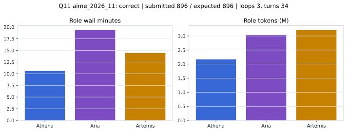

# Q11 aime_2026_11 Report

Outcome: **correct**. Submitted `896`; expected `896`.

## Metrics

| metric | value |
| --- | --- |
| Submitted | 896 |
| Expected | 896 |
| Outcome | correct |
| Status | closed_out_strict_trio_confidence |
| Loops | 3 |
| Turns | 34 |
| Wall time | 45m 36s |
| Total tokens | 8,415,553 |
| Completion tokens | 62,999 |
| Targeted V34 repair question | True |

## Role Runtime

| role | turns | wall_seconds | prompt_tokens | completion_tokens | total_tokens |
| --- | --- | --- | --- | --- | --- |
| Aria | 12 | 1160.6513 | 3003792 | 32916 | 3036708 |
| Artemis | 13 | 866.3178 | 3194536 | 15974 | 3210510 |
| Athena | 9 | 635.3848 | 2154226 | 14109 | 2168335 |

## Final Candidate State

| role | candidate | confidence |
| --- | --- | --- |
| Athena | 896 | 99 |
| Aria | 896 | 92 |
| Artemis | 896 | 92 |

## Artifact Comparison

| artifact | answer | correct | tokens |
| --- | --- | --- | --- |
| Artifact 01 frozen pruned | 8 |  | 711,396 |
| Artifact 02 unrestricted | 896 | True | 1,112,040 |
| Artifact 03 Apr27 benchmarkgrade | 896 | True | 130,556 |
| Artifact 04 Apr28 RAB v33 | 584 |  | 143,201 |
| Artifact 06 V34 full test run | 896 | True | 8,415,553 |

## Diagnostic

Targeted V34 Runtime-at-Boot repair succeeded on a prior miss.

## Source

- Transcript: [`raw_export/transcripts/aime_2026_11.txt`](../raw_export/transcripts/aime_2026_11.txt)
- Result payload: [`raw_export/result_payloads/aime_2026_11.json`](../raw_export/result_payloads/aime_2026_11.json)
