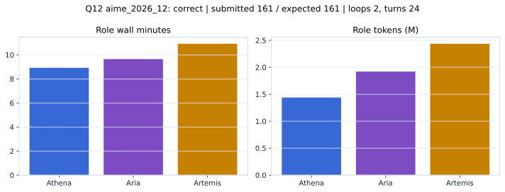

# Q12 aime_2026_12 Report

Outcome: **correct**. Submitted `161`; expected `161`.

## Metrics

| metric | value |
| --- | --- |
| Submitted | 161 |
| Expected | 161 |
| Outcome | correct |
| Status | closed_out_strict_trio_confidence |
| Loops | 2 |
| Turns | 24 |
| Wall time | 30m 22s |
| Total tokens | 5,797,540 |
| Completion tokens | 41,550 |
| Targeted V34 repair question | False |

## Role Runtime

| role | turns | wall_seconds | prompt_tokens | completion_tokens | total_tokens |
| --- | --- | --- | --- | --- | --- |
| Aria | 8 | 579.1383 | 1907497 | 13445 | 1920942 |
| Artemis | 10 | 655.6096 | 2424636 | 12344 | 2436980 |
| Athena | 6 | 535.4023 | 1423857 | 15761 | 1439618 |

## Final Candidate State

| role | candidate | confidence |
| --- | --- | --- |
| Athena | 161 | 100 |
| Aria | 161 | 100 |
| Artemis | 161 | 100 |

## Artifact Comparison

| artifact | answer | correct | tokens |
| --- | --- | --- | --- |
| Artifact 01 frozen pruned | 37 |  | 720,114 |
| Artifact 02 unrestricted | 161 | True | 1,204,749 |
| Artifact 03 Apr27 benchmarkgrade | 161 | True | 130,977 |
| Artifact 04 Apr28 RAB v33 | 161 | True | 123,315 |
| Artifact 06 V34 full test run | 161 | True | 5,797,540 |

## Diagnostic

Stable correct closeout.

## Source

- Transcript: [`raw_export/transcripts/aime_2026_12.txt`](../raw_export/transcripts/aime_2026_12.txt)
- Result payload: [`raw_export/result_payloads/aime_2026_12.json`](../raw_export/result_payloads/aime_2026_12.json)
