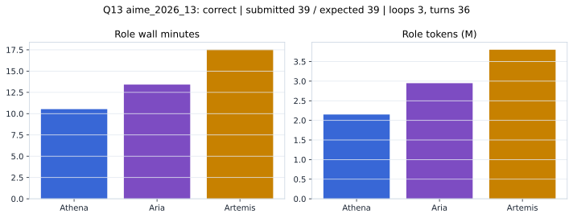

# Q13 aime_2026_13 Report

Outcome: **correct**. Submitted `39`; expected `39`.

## Metrics

| metric | value |
| --- | --- |
| Submitted | 39 |
| Expected | 39 |
| Outcome | correct |
| Status | closed_out_max_loop_best_confidence_arbitration |
| Loops | 3 |
| Turns | 36 |
| Wall time | 42m 46s |
| Total tokens | 8,900,554 |
| Completion tokens | 48,511 |
| Targeted V34 repair question | False |

## Role Runtime

| role | turns | wall_seconds | prompt_tokens | completion_tokens | total_tokens |
| --- | --- | --- | --- | --- | --- |
| Aria | 12 | 805.0887 | 2933464 | 15302 | 2948766 |
| Artemis | 15 | 1050.7768 | 3783285 | 18984 | 3802269 |
| Athena | 9 | 632.0215 | 2135294 | 14225 | 2149519 |

## Final Candidate State

| role | candidate | confidence |
| --- | --- | --- |
| Athena | 39 | 100 |
| Aria | 39 | 100 |
| Artemis | 39 | 100 |

## Artifact Comparison

| artifact | answer | correct | tokens |
| --- | --- | --- | --- |
| Artifact 01 frozen pruned | 58 |  | 720,072 |
| Artifact 02 unrestricted | 79 |  | 1,131,323 |
| Artifact 03 Apr27 benchmarkgrade | 39 | True | 145,768 |
| Artifact 04 Apr28 RAB v33 | 39 | True | 165,446 |
| Artifact 06 V34 full test run | 39 | True | 8,900,554 |

## Diagnostic

Stable correct closeout.

## Source

- Transcript: [`raw_export/transcripts/aime_2026_13.txt`](../raw_export/transcripts/aime_2026_13.txt)
- Result payload: [`raw_export/result_payloads/aime_2026_13.json`](../raw_export/result_payloads/aime_2026_13.json)
