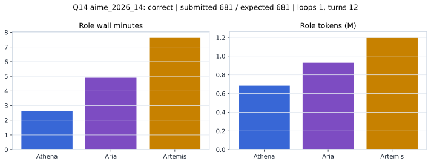

# Q14 aime_2026_14 Report

Outcome: **correct**. Submitted `681`; expected `681`.

## Metrics

| metric | value |
| --- | --- |
| Submitted | 681 |
| Expected | 681 |
| Outcome | correct |
| Status | closed_out_strict_trio_confidence |
| Loops | 1 |
| Turns | 12 |
| Wall time | 15m 36s |
| Total tokens | 2,814,568 |
| Completion tokens | 23,778 |
| Targeted V34 repair question | False |

## Role Runtime

| role | turns | wall_seconds | prompt_tokens | completion_tokens | total_tokens |
| --- | --- | --- | --- | --- | --- |
| Aria | 4 | 294.0318 | 922206 | 7539 | 929745 |
| Artemis | 5 | 459.4927 | 1187290 | 13850 | 1201140 |
| Athena | 3 | 157.9568 | 681294 | 2389 | 683683 |

## Final Candidate State

| role | candidate | confidence |
| --- | --- | --- |
| Athena | 681 | 98 |
| Aria | 681 | 98 |
| Artemis | 681 | 98 |

## Artifact Comparison

| artifact | answer | correct | tokens |
| --- | --- | --- | --- |
| Artifact 01 frozen pruned | 382 |  | 716,369 |
| Artifact 02 unrestricted | 676 |  | 1,205,032 |
| Artifact 03 Apr27 benchmarkgrade | 681 | True | 143,609 |
| Artifact 04 Apr28 RAB v33 | 681 | True | 110,315 |
| Artifact 06 V34 full test run | 681 | True | 2,814,568 |

## Diagnostic

Stable correct closeout.

## Source

- Transcript: [`raw_export/transcripts/aime_2026_14.txt`](../raw_export/transcripts/aime_2026_14.txt)
- Result payload: [`raw_export/result_payloads/aime_2026_14.json`](../raw_export/result_payloads/aime_2026_14.json)
