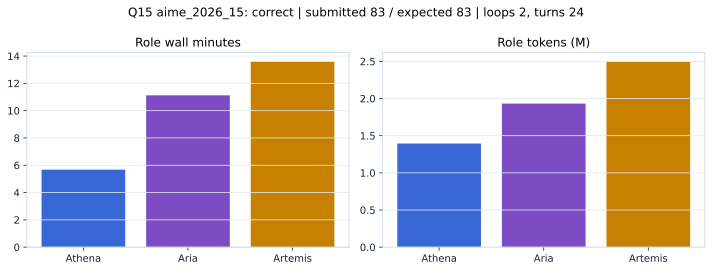

# Q15 aime_2026_15 Report

Outcome: **correct**. Submitted `83`; expected `83`.

## Metrics

| metric | value |
| --- | --- |
| Submitted | 83 |
| Expected | 83 |
| Outcome | correct |
| Status | closed_out_strict_trio_confidence |
| Loops | 2 |
| Turns | 24 |
| Wall time | 31m 15s |
| Total tokens | 5,821,015 |
| Completion tokens | 43,850 |
| Targeted V34 repair question | True |

## Role Runtime

| role | turns | wall_seconds | prompt_tokens | completion_tokens | total_tokens |
| --- | --- | --- | --- | --- | --- |
| Aria | 8 | 667.436 | 1913688 | 18076 | 1931764 |
| Artemis | 10 | 814.8419 | 2474664 | 20089 | 2494753 |
| Athena | 6 | 340.5476 | 1388813 | 5685 | 1394498 |

## Final Candidate State

| role | candidate | confidence |
| --- | --- | --- |
| Athena | 83 | 100 |
| Aria | 83 | 100 |
| Artemis | 83 | 100 |

## Artifact Comparison

| artifact | answer | correct | tokens |
| --- | --- | --- | --- |
| Artifact 01 frozen pruned | 1 |  | 718,849 |
| Artifact 02 unrestricted | 2 |  | 1,122,386 |
| Artifact 03 Apr27 benchmarkgrade | 2 |  | 161,614 |
| Artifact 04 Apr28 RAB v33 | 1 |  | 106,119 |
| Artifact 06 V34 full test run | 83 | True | 5,821,015 |

## Diagnostic

Targeted V34 Runtime-at-Boot repair succeeded on a prior miss.

## Source

- Transcript: [`raw_export/transcripts/aime_2026_15.txt`](../raw_export/transcripts/aime_2026_15.txt)
- Result payload: [`raw_export/result_payloads/aime_2026_15.json`](../raw_export/result_payloads/aime_2026_15.json)
