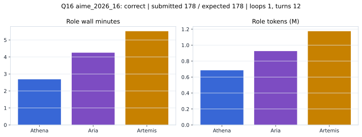

# Q16 aime_2026_16 Report

Outcome: **correct**. Submitted `178`; expected `178`.

## Metrics

| metric | value |
| --- | --- |
| Submitted | 178 |
| Expected | 178 |
| Outcome | correct |
| Status | closed_out_strict_trio_confidence |
| Loops | 1 |
| Turns | 12 |
| Wall time | 12m 51s |
| Total tokens | 2,784,644 |
| Completion tokens | 15,147 |
| Targeted V34 repair question | False |

## Role Runtime

| role | turns | wall_seconds | prompt_tokens | completion_tokens | total_tokens |
| --- | --- | --- | --- | --- | --- |
| Aria | 4 | 255.1978 | 920089 | 5445 | 925534 |
| Artemis | 5 | 330.9247 | 1167261 | 7154 | 1174415 |
| Athena | 3 | 161.153 | 682147 | 2548 | 684695 |

## Final Candidate State

| role | candidate | confidence |
| --- | --- | --- |
| Athena | 178 | 100 |
| Aria | 178 | 100 |
| Artemis | 178 | 100 |

## Artifact Comparison

| artifact | answer | correct | tokens |
| --- | --- | --- | --- |
| Artifact 01 frozen pruned | 178 | True | 695,300 |
| Artifact 02 unrestricted | 178 | True | 1,023,191 |
| Artifact 03 Apr27 benchmarkgrade | 178 | True | 83,367 |
| Artifact 04 Apr28 RAB v33 | 178 | True | 90,200 |
| Artifact 06 V34 full test run | 178 | True | 2,784,644 |

## Diagnostic

Stable correct closeout.

## Source

- Transcript: [`raw_export/transcripts/aime_2026_16.txt`](../raw_export/transcripts/aime_2026_16.txt)
- Result payload: [`raw_export/result_payloads/aime_2026_16.json`](../raw_export/result_payloads/aime_2026_16.json)
