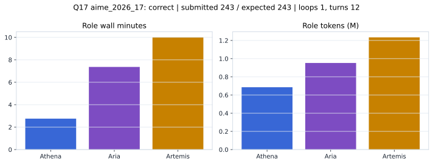

# Q17 aime_2026_17 Report

Outcome: **correct**. Submitted `243`; expected `243`.

## Metrics

| metric | value |
| --- | --- |
| Submitted | 243 |
| Expected | 243 |
| Outcome | correct |
| Status | closed_out_strict_trio_confidence |
| Loops | 1 |
| Turns | 12 |
| Wall time | 20m 32s |
| Total tokens | 2,871,448 |
| Completion tokens | 39,176 |
| Targeted V34 repair question | True |

## Role Runtime

| role | turns | wall_seconds | prompt_tokens | completion_tokens | total_tokens |
| --- | --- | --- | --- | --- | --- |
| Aria | 4 | 442.0158 | 936853 | 15391 | 952244 |
| Artemis | 5 | 599.9797 | 1212724 | 21025 | 1233749 |
| Athena | 3 | 165.2696 | 682695 | 2760 | 685455 |

## Final Candidate State

| role | candidate | confidence |
| --- | --- | --- |
| Athena | 243 | 95 |
| Aria | 243 | 95 |
| Artemis | 243 | 95 |

## Artifact Comparison

| artifact | answer | correct | tokens |
| --- | --- | --- | --- |
| Artifact 01 frozen pruned | 10 |  | 721,538 |
| Artifact 02 unrestricted | 243 | True | 1,228,745 |
| Artifact 03 Apr27 benchmarkgrade | 198 |  | 159,387 |
| Artifact 04 Apr28 RAB v33 | 69 |  | 170,895 |
| Artifact 06 V34 full test run | 243 | True | 2,871,448 |

## Diagnostic

Targeted V34 Runtime-at-Boot repair succeeded on a prior miss.

## Source

- Transcript: [`raw_export/transcripts/aime_2026_17.txt`](../raw_export/transcripts/aime_2026_17.txt)
- Result payload: [`raw_export/result_payloads/aime_2026_17.json`](../raw_export/result_payloads/aime_2026_17.json)
