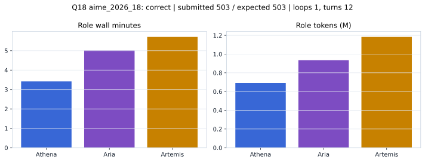

# Q18 aime_2026_18 Report

Outcome: **correct**. Submitted `503`; expected `503`.

## Metrics

| metric | value |
| --- | --- |
| Submitted | 503 |
| Expected | 503 |
| Outcome | correct |
| Status | closed_out_strict_trio_confidence |
| Loops | 1 |
| Turns | 12 |
| Wall time | 14m 33s |
| Total tokens | 2,808,940 |
| Completion tokens | 20,416 |
| Targeted V34 repair question | True |

## Role Runtime

| role | turns | wall_seconds | prompt_tokens | completion_tokens | total_tokens |
| --- | --- | --- | --- | --- | --- |
| Aria | 4 | 300.7721 | 927336 | 7832 | 935168 |
| Artemis | 5 | 342.6347 | 1175614 | 7671 | 1183285 |
| Athena | 3 | 205.1011 | 685574 | 4913 | 690487 |

## Final Candidate State

| role | candidate | confidence |
| --- | --- | --- |
| Athena | 503 | 100 |
| Aria | 503 | 100 |
| Artemis | 503 | 100 |

## Artifact Comparison

| artifact | answer | correct | tokens |
| --- | --- | --- | --- |
| Artifact 01 frozen pruned | 999 |  | 719,602 |
| Artifact 02 unrestricted | 997 |  | 1,186,776 |
| Artifact 03 Apr27 benchmarkgrade | 503 | True | 150,956 |
| Artifact 04 Apr28 RAB v33 | 505 |  | 168,772 |
| Artifact 06 V34 full test run | 503 | True | 2,808,940 |

## Diagnostic

Targeted V34 Runtime-at-Boot repair succeeded on a prior miss.

## Source

- Transcript: [`raw_export/transcripts/aime_2026_18.txt`](../raw_export/transcripts/aime_2026_18.txt)
- Result payload: [`raw_export/result_payloads/aime_2026_18.json`](../raw_export/result_payloads/aime_2026_18.json)
