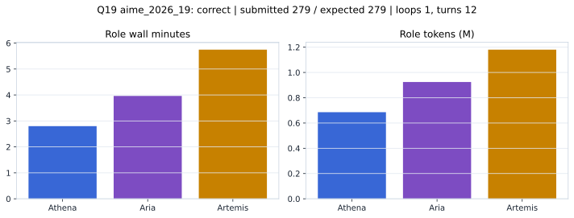

# Q19 aime_2026_19 Report

Outcome: **correct**. Submitted `279`; expected `279`.

## Metrics

| metric | value |
| --- | --- |
| Submitted | 279 |
| Expected | 279 |
| Outcome | correct |
| Status | closed_out_strict_trio_confidence |
| Loops | 1 |
| Turns | 12 |
| Wall time | 12m 55s |
| Total tokens | 2,790,170 |
| Completion tokens | 15,235 |
| Targeted V34 repair question | False |

## Role Runtime

| role | turns | wall_seconds | prompt_tokens | completion_tokens | total_tokens |
| --- | --- | --- | --- | --- | --- |
| Aria | 4 | 237.8587 | 920073 | 4493 | 924566 |
| Artemis | 5 | 344.7433 | 1172372 | 7813 | 1180185 |
| Athena | 3 | 168.0558 | 682490 | 2929 | 685419 |

## Final Candidate State

| role | candidate | confidence |
| --- | --- | --- |
| Athena | 279 | 100 |
| Aria | 279 | 100 |
| Artemis | 279 | 100 |

## Artifact Comparison

| artifact | answer | correct | tokens |
| --- | --- | --- | --- |
| Artifact 01 frozen pruned | 271 |  | 701,936 |
| Artifact 02 unrestricted | 279 | True | 1,104,156 |
| Artifact 03 Apr27 benchmarkgrade | 279 | True | 117,174 |
| Artifact 04 Apr28 RAB v33 | 279 | True | 122,336 |
| Artifact 06 V34 full test run | 279 | True | 2,790,170 |

## Diagnostic

Stable correct closeout.

## Source

- Transcript: [`raw_export/transcripts/aime_2026_19.txt`](../raw_export/transcripts/aime_2026_19.txt)
- Result payload: [`raw_export/result_payloads/aime_2026_19.json`](../raw_export/result_payloads/aime_2026_19.json)
