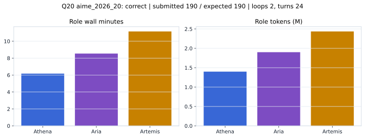

# Q20 aime_2026_20 Report

Outcome: **correct**. Submitted `190`; expected `190`.

## Metrics

| metric | value |
| --- | --- |
| Submitted | 190 |
| Expected | 190 |
| Outcome | correct |
| Status | closed_out_strict_trio_confidence |
| Loops | 2 |
| Turns | 24 |
| Wall time | 26m 42s |
| Total tokens | 5,734,622 |
| Completion tokens | 30,462 |
| Targeted V34 repair question | False |

## Role Runtime

| role | turns | wall_seconds | prompt_tokens | completion_tokens | total_tokens |
| --- | --- | --- | --- | --- | --- |
| Aria | 8 | 512.5472 | 1890692 | 10095 | 1900787 |
| Artemis | 10 | 669.2912 | 2422310 | 13089 | 2435399 |
| Athena | 6 | 370.1644 | 1391158 | 7278 | 1398436 |

## Final Candidate State

| role | candidate | confidence |
| --- | --- | --- |
| Athena | 190 | 100 |
| Aria | 190 | 100 |
| Artemis | 190 | 100 |

## Artifact Comparison

| artifact | answer | correct | tokens |
| --- | --- | --- | --- |
| Artifact 01 frozen pruned | 190 | True | 698,679 |
| Artifact 02 unrestricted | 190 | True | 1,045,000 |
| Artifact 03 Apr27 benchmarkgrade | 190 | True | 117,312 |
| Artifact 04 Apr28 RAB v33 | 190 | True | 123,833 |
| Artifact 06 V34 full test run | 190 | True | 5,734,622 |

## Diagnostic

Stable correct closeout.

## Source

- Transcript: [`raw_export/transcripts/aime_2026_20.txt`](../raw_export/transcripts/aime_2026_20.txt)
- Result payload: [`raw_export/result_payloads/aime_2026_20.json`](../raw_export/result_payloads/aime_2026_20.json)
