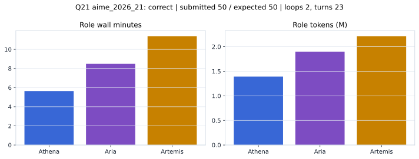

# Q21 aime_2026_21 Report

Outcome: **correct**. Submitted `50`; expected `50`.

## Metrics

| metric | value |
| --- | --- |
| Submitted | 50 |
| Expected | 50 |
| Outcome | correct |
| Status | closed_out_strict_trio_confidence |
| Loops | 2 |
| Turns | 23 |
| Wall time | 26m 19s |
| Total tokens | 5,503,452 |
| Completion tokens | 31,433 |
| Targeted V34 repair question | True |

## Role Runtime

| role | turns | wall_seconds | prompt_tokens | completion_tokens | total_tokens |
| --- | --- | --- | --- | --- | --- |
| Aria | 8 | 509.4619 | 1888917 | 9938 | 1898855 |
| Artemis | 9 | 682.1954 | 2196671 | 15895 | 2212566 |
| Athena | 6 | 338.3539 | 1386431 | 5600 | 1392031 |

## Final Candidate State

| role | candidate | confidence |
| --- | --- | --- |
| Athena | 50 | 100 |
| Aria | 50 | 100 |
| Artemis | 50 | 92 |

## Artifact Comparison

| artifact | answer | correct | tokens |
| --- | --- | --- | --- |
| Artifact 01 frozen pruned | 50 | True | 717,023 |
| Artifact 02 unrestricted | 50 | True | 1,125,454 |
| Artifact 03 Apr27 benchmarkgrade | 37 |  | 116,816 |
| Artifact 04 Apr28 RAB v33 | 18 |  | 115,795 |
| Artifact 06 V34 full test run | 50 | True | 5,503,452 |

## Diagnostic

Targeted V34 Runtime-at-Boot repair succeeded on a prior miss.

## Source

- Transcript: [`raw_export/transcripts/aime_2026_21.txt`](../raw_export/transcripts/aime_2026_21.txt)
- Result payload: [`raw_export/result_payloads/aime_2026_21.json`](../raw_export/result_payloads/aime_2026_21.json)
