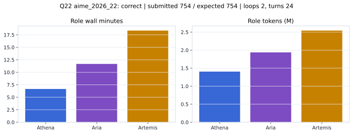

# Q22 aime_2026_22 Report

Outcome: **correct**. Submitted `754`; expected `754`.

## Metrics

| metric | value |
| --- | --- |
| Submitted | 754 |
| Expected | 754 |
| Outcome | correct |
| Status | closed_out_strict_trio_confidence |
| Loops | 2 |
| Turns | 24 |
| Wall time | 37m 35s |
| Total tokens | 5,886,407 |
| Completion tokens | 63,235 |
| Targeted V34 repair question | False |

## Role Runtime

| role | turns | wall_seconds | prompt_tokens | completion_tokens | total_tokens |
| --- | --- | --- | --- | --- | --- |
| Aria | 8 | 700.5359 | 1918378 | 19783 | 1938161 |
| Artemis | 10 | 1101.7138 | 2509304 | 34659 | 2543963 |
| Athena | 6 | 399.4527 | 1395490 | 8793 | 1404283 |

## Final Candidate State

| role | candidate | confidence |
| --- | --- | --- |
| Athena | 754 | 99 |
| Aria | 754 | 98 |
| Artemis | 754 | 99 |

## Artifact Comparison

| artifact | answer | correct | tokens |
| --- | --- | --- | --- |
| Artifact 01 frozen pruned | 754 | True | 710,160 |
| Artifact 02 unrestricted | 754 | True | 1,097,586 |
| Artifact 03 Apr27 benchmarkgrade | 754 | True | 132,885 |
| Artifact 04 Apr28 RAB v33 | 754 | True | 153,697 |
| Artifact 06 V34 full test run | 754 | True | 5,886,407 |

## Diagnostic

Stable correct closeout.

## Source

- Transcript: [`raw_export/transcripts/aime_2026_22.txt`](../raw_export/transcripts/aime_2026_22.txt)
- Result payload: [`raw_export/result_payloads/aime_2026_22.json`](../raw_export/result_payloads/aime_2026_22.json)
