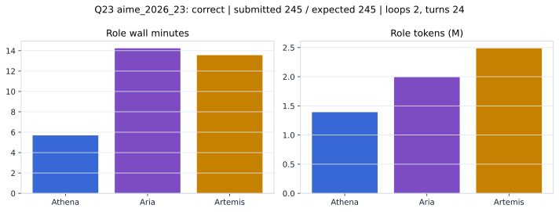

# Q23 aime_2026_23 Report

Outcome: **correct**. Submitted `245`; expected `245`.

## Metrics

| metric | value |
| --- | --- |
| Submitted | 245 |
| Expected | 245 |
| Outcome | correct |
| Status | closed_out_strict_trio_confidence |
| Loops | 2 |
| Turns | 24 |
| Wall time | 34m 22s |
| Total tokens | 5,876,031 |
| Completion tokens | 53,156 |
| Targeted V34 repair question | True |

## Role Runtime

| role | turns | wall_seconds | prompt_tokens | completion_tokens | total_tokens |
| --- | --- | --- | --- | --- | --- |
| Aria | 8 | 854.0564 | 1969822 | 27209 | 1997031 |
| Artemis | 10 | 813.8023 | 2467179 | 20184 | 2487363 |
| Athena | 6 | 341.317 | 1385874 | 5763 | 1391637 |

## Final Candidate State

| role | candidate | confidence |
| --- | --- | --- |
| Athena | 245 | 100 |
| Aria | 245 | 100 |
| Artemis | 245 | 100 |

## Artifact Comparison

| artifact | answer | correct | tokens |
| --- | --- | --- | --- |
| Artifact 01 frozen pruned | 125 |  | 719,205 |
| Artifact 02 unrestricted | 245 | True | 1,259,225 |
| Artifact 03 Apr27 benchmarkgrade | 245 | True | 148,306 |
| Artifact 04 Apr28 RAB v33 | 125 |  | 172,481 |
| Artifact 06 V34 full test run | 245 | True | 5,876,031 |

## Diagnostic

Targeted V34 Runtime-at-Boot repair succeeded on a prior miss.

## Source

- Transcript: [`raw_export/transcripts/aime_2026_23.txt`](../raw_export/transcripts/aime_2026_23.txt)
- Result payload: [`raw_export/result_payloads/aime_2026_23.json`](../raw_export/result_payloads/aime_2026_23.json)
