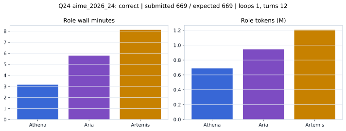

# Q24 aime_2026_24 Report

Outcome: **correct**. Submitted `669`; expected `669`.

## Metrics

| metric | value |
| --- | --- |
| Submitted | 669 |
| Expected | 669 |
| Outcome | correct |
| Status | closed_out_strict_trio_confidence |
| Loops | 1 |
| Turns | 12 |
| Wall time | 17m 30s |
| Total tokens | 2,837,717 |
| Completion tokens | 29,705 |
| Targeted V34 repair question | True |

## Role Runtime

| role | turns | wall_seconds | prompt_tokens | completion_tokens | total_tokens |
| --- | --- | --- | --- | --- | --- |
| Aria | 4 | 347.3903 | 932916 | 10292 | 943208 |
| Artemis | 5 | 487.4419 | 1191020 | 15322 | 1206342 |
| Athena | 3 | 189.7239 | 684076 | 4091 | 688167 |

## Final Candidate State

| role | candidate | confidence |
| --- | --- | --- |
| Athena | 669 | 99 |
| Aria | 669 | 95 |
| Artemis | 669 | 95 |

## Artifact Comparison

| artifact | answer | correct | tokens |
| --- | --- | --- | --- |
| Artifact 01 frozen pruned | 669 | True | 708,800 |
| Artifact 02 unrestricted | 669 | True | 1,176,383 |
| Artifact 03 Apr27 benchmarkgrade | 669 | True | 128,769 |
| Artifact 04 Apr28 RAB v33 | 558 |  | 123,632 |
| Artifact 06 V34 full test run | 669 | True | 2,837,717 |

## Diagnostic

Targeted V34 Runtime-at-Boot repair succeeded on a prior miss.

## Source

- Transcript: [`raw_export/transcripts/aime_2026_24.txt`](../raw_export/transcripts/aime_2026_24.txt)
- Result payload: [`raw_export/result_payloads/aime_2026_24.json`](../raw_export/result_payloads/aime_2026_24.json)
