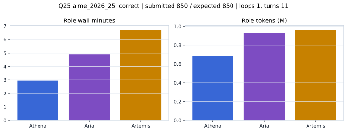

# Q25 aime_2026_25 Report

Outcome: **correct**. Submitted `850`; expected `850`.

## Metrics

| metric | value |
| --- | --- |
| Submitted | 850 |
| Expected | 850 |
| Outcome | correct |
| Status | closed_out_strict_trio_confidence |
| Loops | 1 |
| Turns | 11 |
| Wall time | 14m 57s |
| Total tokens | 2,578,015 |
| Completion tokens | 24,003 |
| Targeted V34 repair question | False |

## Role Runtime

| role | turns | wall_seconds | prompt_tokens | completion_tokens | total_tokens |
| --- | --- | --- | --- | --- | --- |
| Aria | 4 | 294.9153 | 923517 | 7566 | 931083 |
| Artemis | 4 | 402.1887 | 947937 | 13042 | 960979 |
| Athena | 3 | 176.7325 | 682558 | 3395 | 685953 |

## Final Candidate State

| role | candidate | confidence |
| --- | --- | --- |
| Athena | 850 | 100 |
| Aria | 850 | 100 |
| Artemis | 850 | 92 |

## Artifact Comparison

| artifact | answer | correct | tokens |
| --- | --- | --- | --- |
| Artifact 01 frozen pruned | 850 | True | 703,136 |
| Artifact 02 unrestricted | 850 | True | 1,149,893 |
| Artifact 03 Apr27 benchmarkgrade | 850 | True | 128,303 |
| Artifact 04 Apr28 RAB v33 | 850 | True | 125,317 |
| Artifact 06 V34 full test run | 850 | True | 2,578,015 |

## Diagnostic

Stable correct closeout.

## Source

- Transcript: [`raw_export/transcripts/aime_2026_25.txt`](../raw_export/transcripts/aime_2026_25.txt)
- Result payload: [`raw_export/result_payloads/aime_2026_25.json`](../raw_export/result_payloads/aime_2026_25.json)
