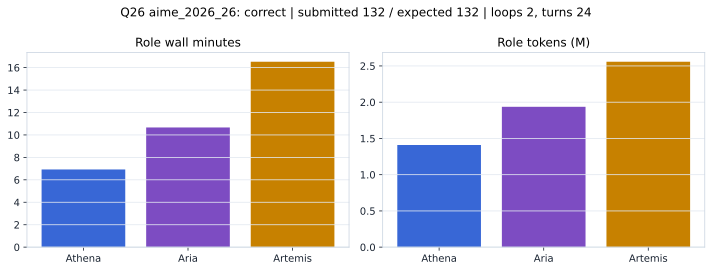

# Q26 aime_2026_26 Report

Outcome: **correct**. Submitted `132`; expected `132`.

## Metrics

| metric | value |
| --- | --- |
| Submitted | 132 |
| Expected | 132 |
| Outcome | correct |
| Status | closed_out_strict_trio_confidence |
| Loops | 2 |
| Turns | 24 |
| Wall time | 35m 00s |
| Total tokens | 5,903,884 |
| Completion tokens | 54,737 |
| Targeted V34 repair question | False |

## Role Runtime

| role | turns | wall_seconds | prompt_tokens | completion_tokens | total_tokens |
| --- | --- | --- | --- | --- | --- |
| Aria | 8 | 639.9998 | 1920060 | 16522 | 1936582 |
| Artemis | 10 | 991.2676 | 2529050 | 28614 | 2557664 |
| Athena | 6 | 415.4694 | 1400037 | 9601 | 1409638 |

## Final Candidate State

| role | candidate | confidence |
| --- | --- | --- |
| Athena | 132 | 100 |
| Aria | 132 | 100 |
| Artemis | 132 | 100 |

## Artifact Comparison

| artifact | answer | correct | tokens |
| --- | --- | --- | --- |
| Artifact 01 frozen pruned | 132 | True | 706,251 |
| Artifact 02 unrestricted | 132 | True | 1,143,561 |
| Artifact 03 Apr27 benchmarkgrade | 132 | True | 150,118 |
| Artifact 04 Apr28 RAB v33 | 132 | True | 148,839 |
| Artifact 06 V34 full test run | 132 | True | 5,903,884 |

## Diagnostic

Stable correct closeout.

## Source

- Transcript: [`raw_export/transcripts/aime_2026_26.txt`](../raw_export/transcripts/aime_2026_26.txt)
- Result payload: [`raw_export/result_payloads/aime_2026_26.json`](../raw_export/result_payloads/aime_2026_26.json)
