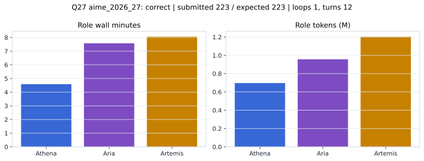

# Q27 aime_2026_27 Report

Outcome: **correct**. Submitted `223`; expected `223`.

## Metrics

| metric | value |
| --- | --- |
| Submitted | 223 |
| Expected | 223 |
| Outcome | correct |
| Status | closed_out_strict_trio_confidence |
| Loops | 1 |
| Turns | 12 |
| Wall time | 20m 39s |
| Total tokens | 2,856,930 |
| Completion tokens | 39,845 |
| Targeted V34 repair question | False |

## Role Runtime

| role | turns | wall_seconds | prompt_tokens | completion_tokens | total_tokens |
| --- | --- | --- | --- | --- | --- |
| Aria | 4 | 454.3784 | 940504 | 16002 | 956506 |
| Artemis | 5 | 483.385 | 1188392 | 15129 | 1203521 |
| Athena | 3 | 274.9731 | 688189 | 8714 | 696903 |

## Final Candidate State

| role | candidate | confidence |
| --- | --- | --- |
| Athena | 223 | 100 |
| Aria | 223 | 98 |
| Artemis | 223 | 100 |

## Artifact Comparison

| artifact | answer | correct | tokens |
| --- | --- | --- | --- |
| Artifact 01 frozen pruned | 97 |  | 714,856 |
| Artifact 02 unrestricted | 223 | True | 1,105,662 |
| Artifact 03 Apr27 benchmarkgrade | 67 |  | 142,291 |
| Artifact 04 Apr28 RAB v33 | 223 | True | 178,898 |
| Artifact 06 V34 full test run | 223 | True | 2,856,930 |

## Diagnostic

Stable correct closeout.

## Source

- Transcript: [`raw_export/transcripts/aime_2026_27.txt`](../raw_export/transcripts/aime_2026_27.txt)
- Result payload: [`raw_export/result_payloads/aime_2026_27.json`](../raw_export/result_payloads/aime_2026_27.json)
