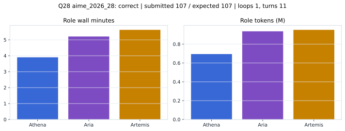

# Q28 aime_2026_28 Report

Outcome: **correct**. Submitted `107`; expected `107`.

## Metrics

| metric | value |
| --- | --- |
| Submitted | 107 |
| Expected | 107 |
| Outcome | correct |
| Status | closed_out_strict_trio_confidence |
| Loops | 1 |
| Turns | 11 |
| Wall time | 15m 07s |
| Total tokens | 2,581,925 |
| Completion tokens | 24,399 |
| Targeted V34 repair question | True |

## Role Runtime

| role | turns | wall_seconds | prompt_tokens | completion_tokens | total_tokens |
| --- | --- | --- | --- | --- | --- |
| Aria | 4 | 312.4109 | 927941 | 8322 | 936263 |
| Artemis | 4 | 337.374 | 941748 | 9600 | 951348 |
| Athena | 3 | 234.0598 | 687837 | 6477 | 694314 |

## Final Candidate State

| role | candidate | confidence |
| --- | --- | --- |
| Athena | 107 | 92 |
| Aria | 107 | 92 |
| Artemis | 107 | 92 |

## Artifact Comparison

| artifact | answer | correct | tokens |
| --- | --- | --- | --- |
| Artifact 01 frozen pruned | 4040 |  | 719,067 |
| Artifact 02 unrestricted | 107 | True | 1,182,933 |
| Artifact 03 Apr27 benchmarkgrade | 107 | True | 145,529 |
| Artifact 04 Apr28 RAB v33 | 12 |  | 116,594 |
| Artifact 06 V34 full test run | 107 | True | 2,581,925 |

## Diagnostic

Targeted V34 Runtime-at-Boot repair succeeded on a prior miss.

## Source

- Transcript: [`raw_export/transcripts/aime_2026_28.txt`](../raw_export/transcripts/aime_2026_28.txt)
- Result payload: [`raw_export/result_payloads/aime_2026_28.json`](../raw_export/result_payloads/aime_2026_28.json)
