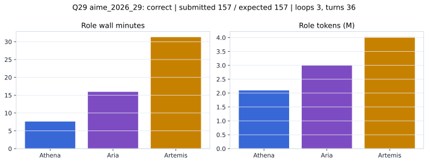

# Q29 aime_2026_29 Report

Outcome: **correct**. Submitted `157`; expected `157`.

## Metrics

| metric | value |
| --- | --- |
| Submitted | 157 |
| Expected | 157 |
| Outcome | correct |
| Status | closed_out_max_loop_best_confidence_arbitration |
| Loops | 3 |
| Turns | 36 |
| Wall time | 56m 12s |
| Total tokens | 9,107,281 |
| Completion tokens | 87,414 |
| Targeted V34 repair question | True |

## Role Runtime

| role | turns | wall_seconds | prompt_tokens | completion_tokens | total_tokens |
| --- | --- | --- | --- | --- | --- |
| Aria | 12 | 956.3581 | 2972228 | 22819 | 2995047 |
| Artemis | 15 | 1877.1215 | 3956010 | 59242 | 4015252 |
| Athena | 9 | 456.2393 | 2091629 | 5353 | 2096982 |

## Final Candidate State

| role | candidate | confidence |
| --- | --- | --- |
| Athena | 157 | 95 |
| Aria | 157 | 95 |
| Artemis | 157 |  |

## Artifact Comparison

| artifact | answer | correct | tokens |
| --- | --- | --- | --- |
| Artifact 01 frozen pruned | 65 |  | 716,415 |
| Artifact 02 unrestricted | 34 |  | 1,177,801 |
| Artifact 03 Apr27 benchmarkgrade | 8 |  | 128,377 |
| Artifact 04 Apr28 RAB v33 | 5 |  | 166,739 |
| Artifact 06 V34 full test run | 157 | True | 9,107,281 |

## Diagnostic

Targeted V34 Runtime-at-Boot repair succeeded on a prior miss.

## Source

- Transcript: [`raw_export/transcripts/aime_2026_29.txt`](../raw_export/transcripts/aime_2026_29.txt)
- Result payload: [`raw_export/result_payloads/aime_2026_29.json`](../raw_export/result_payloads/aime_2026_29.json)
