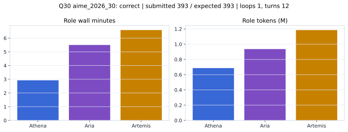

# Q30 aime_2026_30 Report

Outcome: **correct**. Submitted `393`; expected `393`.

## Metrics

| metric | value |
| --- | --- |
| Submitted | 393 |
| Expected | 393 |
| Outcome | correct |
| Status | closed_out_strict_trio_confidence |
| Loops | 1 |
| Turns | 12 |
| Wall time | 15m 26s |
| Total tokens | 2,808,620 |
| Completion tokens | 23,276 |
| Targeted V34 repair question | True |

## Role Runtime

| role | turns | wall_seconds | prompt_tokens | completion_tokens | total_tokens |
| --- | --- | --- | --- | --- | --- |
| Aria | 4 | 329.9627 | 927084 | 9425 | 936509 |
| Artemis | 5 | 395.1288 | 1174998 | 10532 | 1185530 |
| Athena | 3 | 175.4359 | 683262 | 3319 | 686581 |

## Final Candidate State

| role | candidate | confidence |
| --- | --- | --- |
| Athena | 393 | 95 |
| Aria | 393 | 95 |
| Artemis | 393 | 95 |

## Artifact Comparison

| artifact | answer | correct | tokens |
| --- | --- | --- | --- |
| Artifact 01 frozen pruned | 153 |  | 719,855 |
| Artifact 02 unrestricted | 367 |  | 1,169,144 |
| Artifact 03 Apr27 benchmarkgrade | 70 |  | 143,894 |
| Artifact 04 Apr28 RAB v33 | 364 |  | 168,932 |
| Artifact 06 V34 full test run | 393 | True | 2,808,620 |

## Diagnostic

Targeted V34 Runtime-at-Boot repair succeeded on a prior miss.

## Source

- Transcript: [`raw_export/transcripts/aime_2026_30.txt`](../raw_export/transcripts/aime_2026_30.txt)
- Result payload: [`raw_export/result_payloads/aime_2026_30.json`](../raw_export/result_payloads/aime_2026_30.json)
