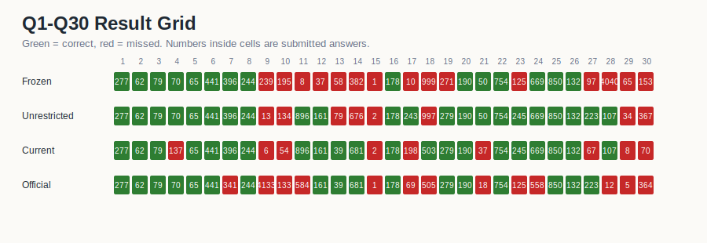
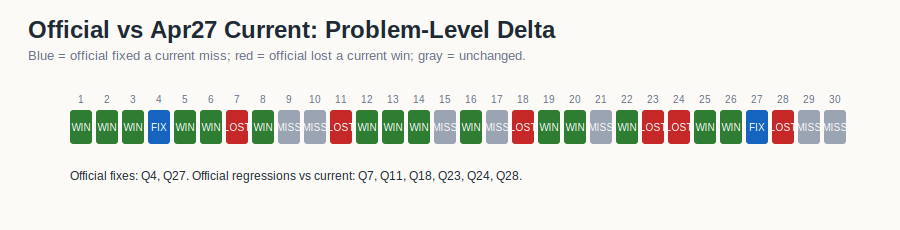

# AEN Revision Artifacts

This directory is the chronological revision ledger for the AEN AIME Q1-Q30 runs.
Folder names use dates plus artifact numbers. They do not use floating labels such
as "current", and they do not treat the April 28 RuntimeAtBoot run as an
authority label. The raw CSV files still preserve legacy run keys for
traceability:

- `frozen` maps to Artifact 01.
- `unrestricted` maps to Artifact 02.
- `current` maps to Artifact 03, the April 27 benchmarkgrade run.
- `official` maps to Artifact 04, the April 28 RuntimeAtBoot experiment.

## Executive Summary

| artifact | folder | score | accuracy | mean tokens/problem | read |
| --- | --- | ---: | ---: | ---: | --- |
| 01 | [`2026-04-27-artifact-01-frozen-pruned-baseline/`](2026-04-27-artifact-01-frozen-pruned-baseline/) | 15/30 | 50.00% | 711,100 | paper pruned baseline |
| 02 | [`2026-04-27-artifact-02-unrestricted-reference/`](2026-04-27-artifact-02-unrestricted-reference/) | 22/30 | 73.33% | 1,125,451 | high-budget reference ceiling |
| 03 | [`2026-04-27-artifact-03-benchmarkgrade-v023/`](2026-04-27-artifact-03-benchmarkgrade-v023/) | 21/30 | 70.00% | 128,625 | low-token benchmarkgrade run |
| 04 | [`2026-04-28-artifact-04-runtime-at-boot-v33-experiment/`](2026-04-28-artifact-04-runtime-at-boot-v33-experiment/) | 17/30 | 56.67% | 134,446 | RuntimeAtBoot negative experiment |
| 05 | [`2026-04-29-artifact-05-q17-q27-transcript-diagnostics/`](2026-04-29-artifact-05-q17-q27-transcript-diagnostics/) | 2/3 selected slice | 66.67% | ~2.21M on Q17 | Q17/Q27 transcript diagnostic; Q27 recovered, Q17 false-confidence miss |
| 06 | [`2026-04-29-artifact-06-v34-full-test-run/`](2026-04-29-artifact-06-v34-full-test-run/) | 29/30 | 96.67% | 4,354,927 | V34 answer-aware Runtime-at-Boot repair full run |

Artifact 02 remains the empirical accuracy ceiling at 22/30, but it spent about
8.75x the tokens of Artifact 03. Artifact 03 is the strongest efficiency result:
21/30 at roughly 11.4% of the unrestricted token budget. Artifact 04 did not
validate the expected RuntimeAtBoot transfer. It passed the boot/certification
shape for the packaged run, but final score dropped to 17/30.

## Visual Summary

## What Changed Across The Artifacts

Artifact 01 established the pruned paper baseline: compact peer structure,
strict caps, 15/30 final score, and a clear late-problem weakness. Artifact 02
expanded the budget and showed the reachable ceiling at 22/30, especially by
recovering difficult later problems, but at a much higher token cost.

Artifact 03 is the April 27 benchmarkgrade v0.2.3 run. It should not be called
"current" in durable documentation because the label expires as soon as a later
run exists. Its durable claim is better stated as: near-unrestricted accuracy
with a much smaller context/token footprint.

Artifact 04 is the April 28 RuntimeAtBoot experiment. The expected outcome was
that boot memory and certification would preserve Artifact 03's gains and maybe
recover additional misses. What happened instead was narrower: Q4 and Q27 were
fixed relative to Artifact 03, but Q7, Q11, Q18, Q23, Q24, and Q28 regressed.
The result is a negative diagnostic, not a success claim.

## Shared Data

The root `data/` directory contains the complete cross-artifact tables:

- [`data/all_four_artifacts_q1_q30_long.csv`](data/all_four_artifacts_q1_q30_long.csv)
- [`data/all_artifacts_summary_q1_q30_and_slices.csv`](data/all_artifacts_summary_q1_q30_and_slices.csv)
- [`data/artifact_comparison_q1_q30.csv`](data/artifact_comparison_q1_q30.csv)
- [`data/runtime_at_boot_artifact_summary.csv`](data/runtime_at_boot_artifact_summary.csv)

Each artifact folder also contains a local `data/` slice and a `visualizations/`
subfolder so it can be read independently.

## Artifact 05 Transcript Diagnostic

Artifact 05 adds the April 29 selected-slice transcript analysis for Q17 and Q27. It is deliberately narrow: Q27 is a corrected geometry-center success (`223`), while Q17 remains an internally verified but externally wrong loop-1 closeout (`32` vs `243`).

Artifact 06 is the April 29 V34 full test run. It is the highest-scoring artifact in the ledger at 29/30, but it is answer-aware because V34 adds repair rows for known AIME-2026 misses. Use it as architecture and Runtime-at-Boot repair evidence, not as a blind benchmark claim.
